# Sesión 01: oTree y Formularios

## Herramientas Técnicas

### oTree

Es una herramienta de código _(librería)_ escrita en Python y que usa Django, que simplificar la construcción y ejecución de experimentos para diferentes ámbitos como Economía Experimental, Psicología Social, Investigación de Mercados, etc.

La facilidad que ofrece oTree es:

- Usar Python para la lógica

- No tener que escribir código específico o detallado para la construcción de formularios, inputs, interacciones, etc.

- Ser en línea: puedes subir a un servidor y compartirlo con todo el mundo para recolectar tus datos.

- Calcular las ganancias en una moneda específica, con un ratio por puntos o por unidad monetaria.

- Configuración de idioma.

- Y lo más importante: código abierto.

### oTreeHub

Es una plataforma creada para facilitar la gestión de proyectos con oTree. Permite:

- Crear un proyecto / experimento / encuesta de manera rápida usando oTreeStudio.

- Descargar en formato `.otreezip` el proyecto creado.

- Interactuar o descargar los proyectos compartidos con otros.

Versiones pagas con:

- Despliegue automático a servidor de Heroku.

- Hacer test automáticos para probar que todo funciona correctamente.

- Compartir tus proyectos.

### Python

Es un lenguaje de programación creado para facilitar crear scripts para personas que no tuvieran conocimientos avanzados con ciencias de la computación, esto gracias a su algo nivel _(cercano al lenguaje natural)_.

:fast_forward: ***Lo abordaremos con más calma en las siguientes sesiones***.

:eyes: **Importante:** La idea es que aprendan a realizar experimentos, no que salgan expertos programadores. 

### Git

Es un sistema de control de versiones, nos ayuda para tener un orden de qué he realizado, qué han realizado las otras personas que colaboran en un proyecto, poder 'viajar en el tiempo' (devolvernos a versiones anteriores).

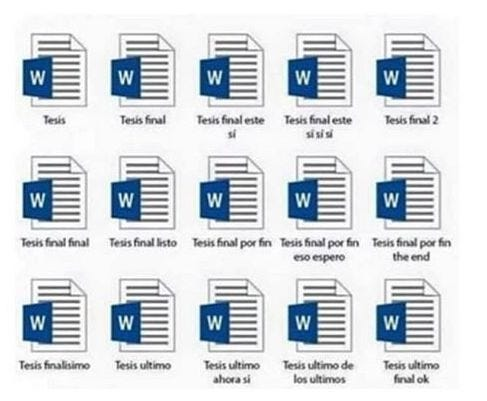

_Imagen tomada de: https://robterceros.medium.com/introducci%C3%B3n-a-git-y-al-control-de-versiones-49ceb8906755_

No solo permite compartir código, sino también texto, imágenes, guías y demás archivos.

Es muy importante porque permite el despliegue atuomático a un servidor de tu preferencia.

:fast_forward: ***Lo abordaremos con más calma en las siguientes sesiones***.

## Formularios

Los formularios son nuestra principal herramienta para la recolección de datos de manera estructurada y nos permite saber como decisiones y preferencias de las personas.

### Taller oTree 1

El taller será desarrollado en [**oTreeHub**](https://www.otreehub.com/), por lo cual es necesario crear una cuenta.

#### Crear cuenta en oTreeHub

1. Ingresamos a [**oTreeHub**](https://www.otreehub.com/) y presionamos en _Register_.


2. Ingresas tu correo electrónico un contraseña para la cuenta. Estas serán tus credenciales cuando requieras ingresar.


> _No pide contraseña complejas_

3. Después de creada la cuenta, te redirecciona a la página principal.


Y ya, con esto tenemos nuestra cuenta para poder usar oTreeHub.

##### Creando nuestro primer formulario

1. Estando en la página principal de **oTreeHub** vamos a [oTreeStudio](https://www.otreehub.com/studio/) para crear nuestro formulario.

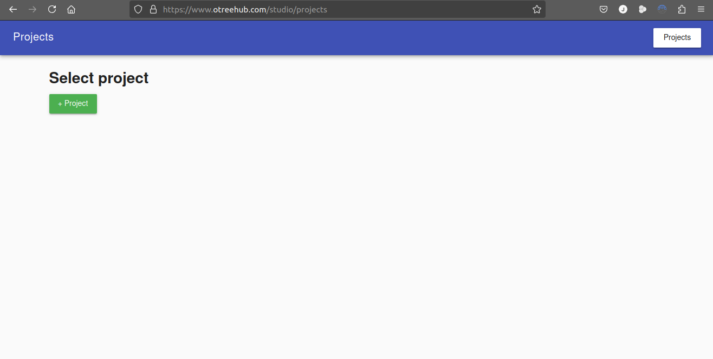

> Para poder crear nuestro formulario primero necesitamos crear un proyecto.

2. Presionamos en `+ Project` y luego `Blank project`, con esto nos creará un nuevo proyecto en blanco.


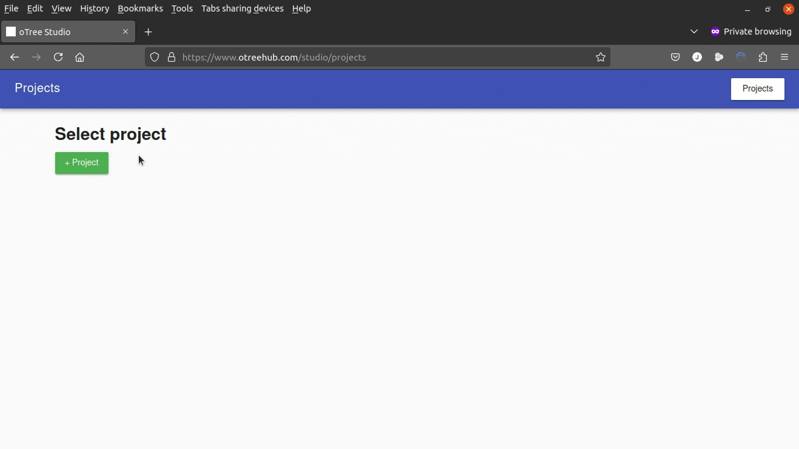

> Por defecto se coloca el nombre `new_project`.

3. Ingresamos a nuestro proyecto llamado `new_project` y nos cargará el entorno de trabajo.


Aquí ya encontramos un menú lateral con varias opciones en las que a medida del curso se irán profundizando, pero de manera rápida:

- **Settings:** Nos permite hacer la configuración general de todo el proyecto / encuesta.

- **Download:** Para descargar nuestro proyecto. Esto lo hace en formato `.otreezip` que es especial de **oTree** y que permite desplegarse en servidores como **Heroku** directamente.

- **Images:** Para cargar imágenes a nuestro proyecto.

- **Session config:** Ya es para la parte final, configurar las sesiones (cantidad participantes, por ejemplo) que se van a tener con este proyecto / encuesta.

- **Apps:** El proyecto o encuesta está compuesto por apps y estas son las que vamos a ir creando. Aquí se pueden crear la cantidad necesaria. _(Para las cuentas gratuitas permite un máximo de 4 apps por proyecto)_.

- **CSS:** Es código para hacer 'bonita' la encuesta.

> Nosotros trabajaremos de momento con Apps

4. Vamos a `Apps` y presionamos `+ App`. Al desplegarse la lista escogemos `[blank app]` para iniciar nuestra aplicación de cero.

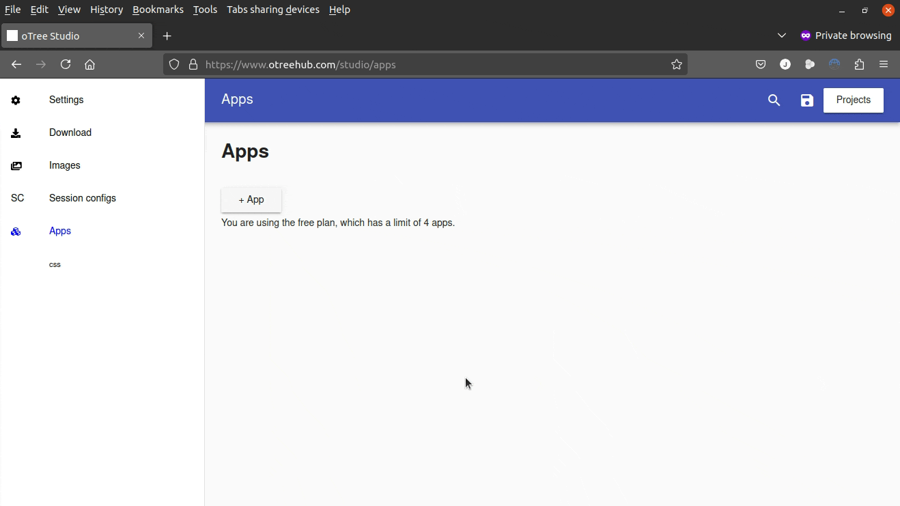

Al crear la app nos lleva a una vista en donde tendremos:

- A nuestro lado derecho la configuración de nuestra app. Aquí podemos definir el nombre y una descripción de esta.

- Al costado izquierdo para poder configurar nuestra app. De igual manera que con las opciones del menú principal iremos profundizando a medida de las clases prácticas, un reconocmiento rápido podemos encontrar:

  - **Constants:** Para definir las constantes generales de la aplicación. Hay unas que son ___reservadas___ por **oTree** para entender cómo debe 'actuar' cuando se de su ejecución.

  - **Subsession:** Para definir las variables de cada subsesión de la aplicación que se genere al momento de ejecutarse.

  - **Group:** Para definir las variables de cada grupo de la aplicación que se genere al momento de ejecutarse.

  - **Player:** Para definir las variables de cada jugador de la aplicación que se genere al momento de ejecutarse.

  - **page_sequence:** Para definir el orden de las páginas a mostrarse en la aplicación. Tenemos de manera básica: Páginas _(Page)_ y Páginas de Espera _(WaitPage)_.

  - **Tests:** Solo válido para cuentas con suscripción paga. Escribe los tests para probar la aplicación.

5. Vamos a cambiar el nombre de nuestra aplicación a `simple_form`.

> **Importante:** El nombre debe ser una sola palabra para la computadora. Se recomienda usar el estándar 'snake case' que es usar guión bajo entre las palabras y en minúsculas.

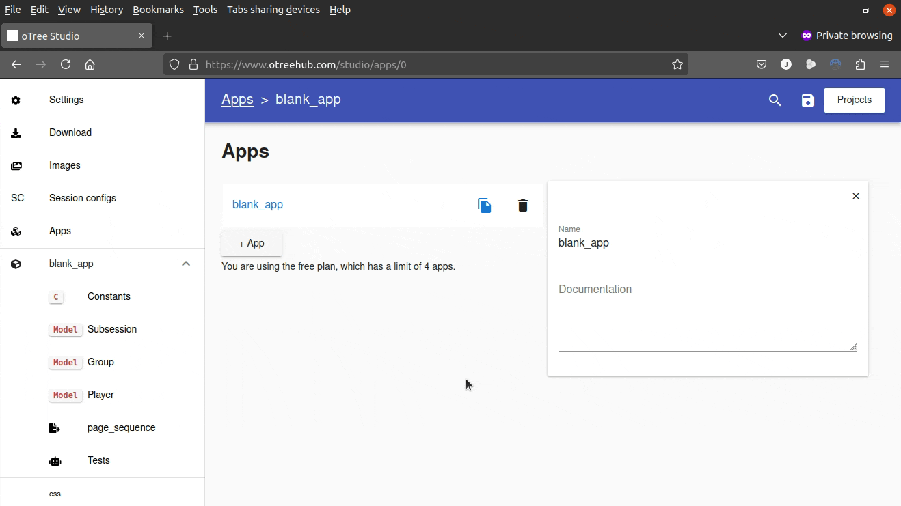

Para este primer formulario vamos a recolectar los datos de edad y nombre en nuestra primera página y mostrarlos en nuestra segunda página.

6. Nos dirigimos al menú lateral izquierdo a la sección `Player` y aquí:

- Vamos a presionar `+ IntegerField`.

- Al cargar la variable vamos al costado derecho y cambiar su nombre a `edad`. Así es como se llamará nuestra variable, en donde se **almacenará** el dato ingresado por la persona.

- Ahora presionamos `+ StringField`y le colocamos por nombre a la variable `nombre`.

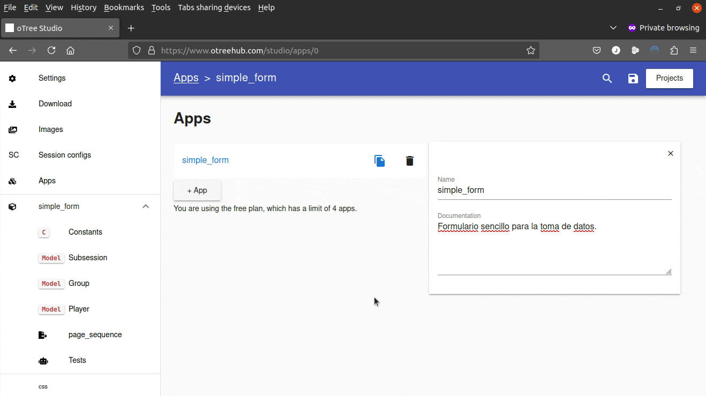

Ya con esto tenemos que vamos a capturar y guardar 2 variables, una de tipo entero y otra tipo cadena de texto.

7. Ahora nos dirigimos a `page_sequence` y al cargar:

- Presionamos sobre `Page`para crear una nueva página básica.

- Al presionar nos lleva a la vista de la nueva página, lo primero es asignarle un nombre.

> El nombre de la página debe empezar por mayúscula y debe ser una sola palabra para la computadora, o sea, sin espacios.

- Presionamos sobre `form_fields` para cargar los campos del formulario. Nos aparecerá abajo para seleccionar la fuente de las variables, que para nuestro taller será `player`. Luego agregamos cuáles son las variables que vamos a solicitar.

- Cambiamos el título de la página según queramos se muestre, en nuestro caso `Toma de datos`.

- Por último, vamos a la parte superior derecha y presionamos sobre el botón de guardar.

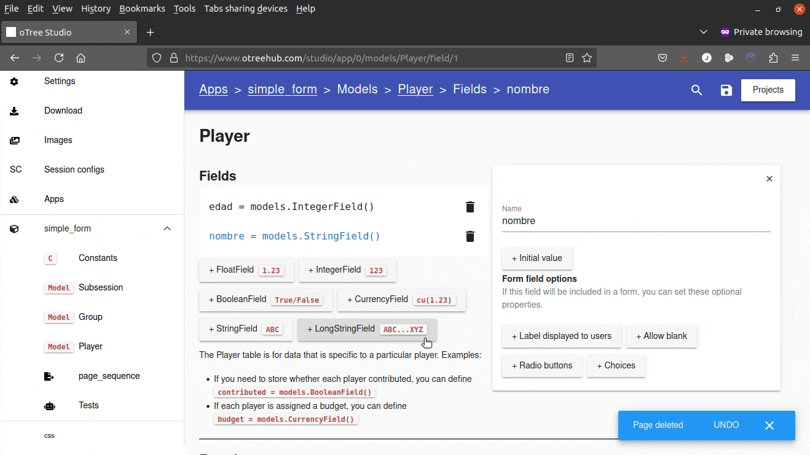

> _Viajando en el tiempo_
>
> Así es como se vería este formulario
>
> 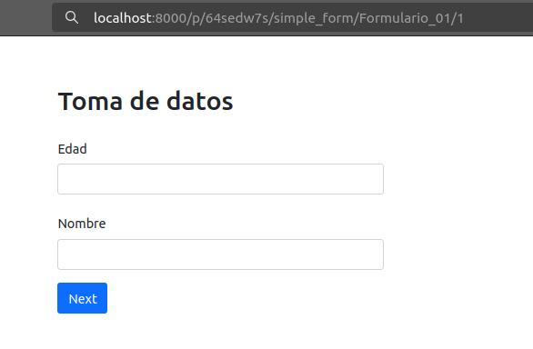
>
> :heartpulse: :boom: :sunglasses:

Ahora nos hace falta la página para mostrar los datos almacenados.

8. Volvemos a `page_sequence` y:

- Presionamos sobre `+ Page`.

- Colocamos el nombre de la página como `Resultados_01`.

- Bajamos y buscamos `{{block_title}}` que es donde asignamos el título de nuestra página y colocamos `Los datos ingresados son:`

- Ahora, vamos a lo :sunglasses: : Algo de programación. Abajo tenemos un recuadro para editar la página en formato `HTML`.

- Eliminamos `{{ form_fields }}` porque no vamos a hacer captura de datos.

- Agregamos el siguiente código:

```HTML
<b>Nombre:</b> {{ player.nombre }}
<br>
<b>Edad:</b> {{ player.edad }}
<br>
```

Aquí unas etiquetas importantes a tener en cuenta y son:

- `<b>Texto aquí</b>` Es una etiqueta para poner en 'negrita' o 'bold' el texto en medio de ella.

- `<br>` Es una etiqueta para poner en 'enter' o 'salto de línea'. **Importante:** En HTML si no colocas el 'enter' todo queda en una sola línea al momento de visualizar.

También, que al momento de querer mostrar el dato guardado en una variable, como lo hacemos en `player` primero debe colocarse esto.

Para mostrar los datos estos deben ir entre llaves dobles.

- Y para finalizar presionamos el botón de guardar arriba a la derecha.

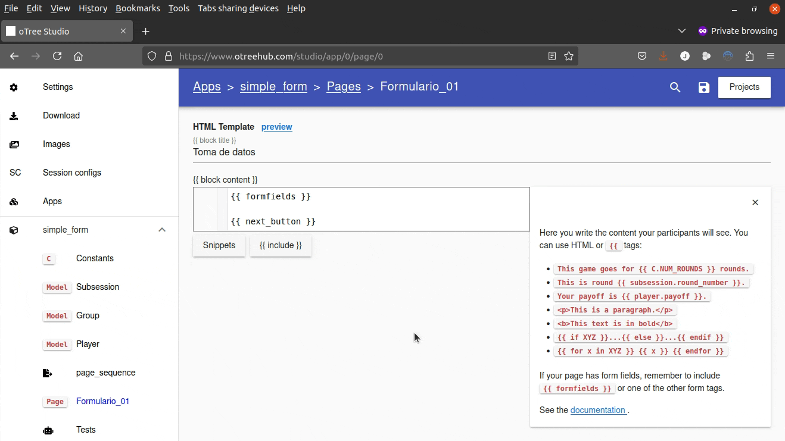

:eyes: Si observas, a medida que vas ingresando para mostrar la variable la plataforma nos ayuda a autocompletar:heavy_exclamation_mark:

> _Viajando en el tiempo_
>
> Así es como se vería este formulario
>
> 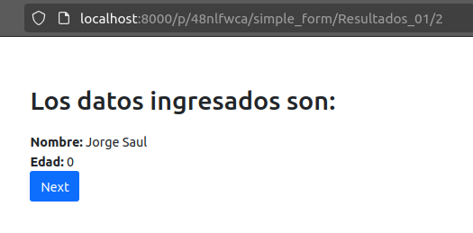
>
> :heartpulse: :boom: :sunglasses:

Entrando ya a la recta final, solo nos faltaría: configurar la sesión, configurar el proyecto y descargarlo.

:x: :sleeping: :x: :sleeping: :x: :sleeping: :x:

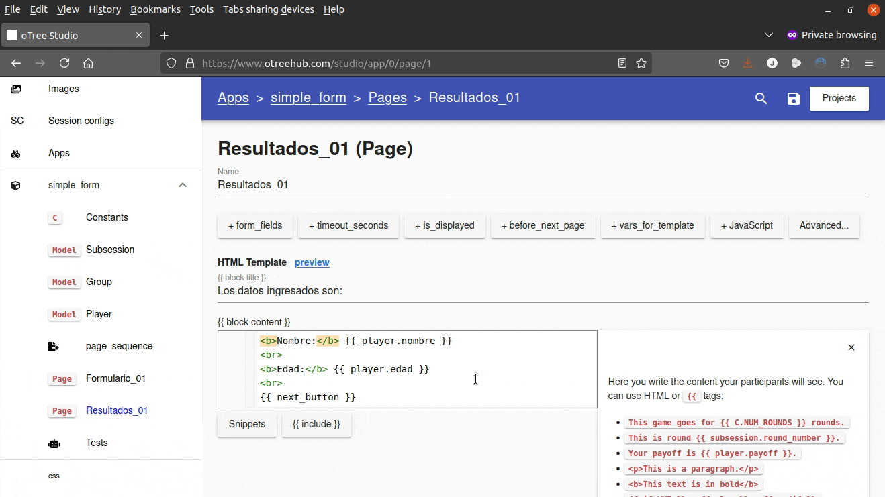

9. Vamos al menú lateral y seleccionamos `Session configs`. Luego:

- En `name` colocamos el nombre de la sesión. Para este ejercicio colocamos `sesion_01`.

- Luego, bajamos y en `app_sequence` escogemos la app que acabamos de terminar de configurar.

- Guardamos presionando al botón arriba a la derecha.

10. Volvemos al menú lateral y seleccionamos `Settings` y al cargar:

- Cambiamos el nombre del proyecto a `formulario_simple`.

- Escogemos el idioma `Spanish`.

- Buscamos a ver si encontramos nuestra moneda `COP`.

- Guardamos el proyecto


11. Por último, vamos a descargar nuestro proyecto. Para eso vamos al menú lateral y seleccionamos `Download`. **Importante:** revisar que no tenga errores.

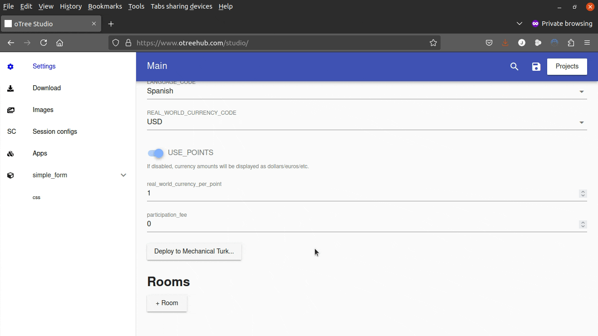

Adicional, oTeeHub da instrucciones de cómo correrlo en Windows y MacOS.

Y ya, eso sería todo ... ... 

<hr>

O no ?

Así sería corriendo nuestro proyecto de manera local o en un servidor:


