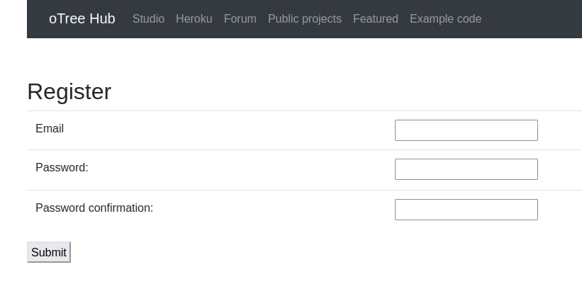
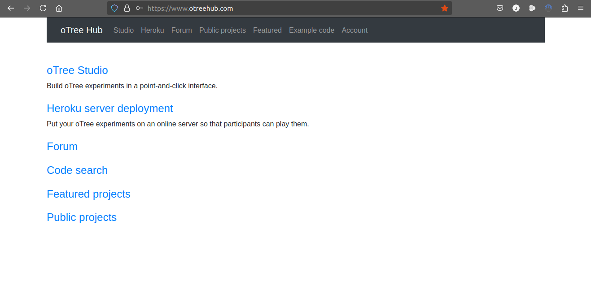

## Sesión 01: oTree, Python, Git, oTreeHub

#### oTree

#### Python

#### Git 

#### oTreeHub

#### Formularios

## Taller oTree 1

El taller será desarrollado en [**oTreeHub**](https://www.otreehub.com/), por lo cual es necesario crear una cuenta.

#### Crear cuenta en oTreeHub

1. Ingresamos a [**oTreeHub**](https://www.otreehub.com/) y presionamos en _Register_.

2. Ingresas tu correo electrónico un contraseña para la cuenta. Estas serán tus credenciales cuando requieras ingresar.

_No pide contraseña complejas_

3. Después de creada la cuenta, te redirecciona a la página principal.

