# Herramientas Técnicas

:wave: Hola!

En esta guía instalaremos y configuraremos de manera básica las herramientas técnicas para poder desarrollar con oTree y tenerlo en nuestras computadoras.

Esta guía está desarrollada para los sistemas operativos [_Windows_](#windows) y [_MacOS_](#macos).

Las herramientas que vamos a trabajar son:

1. VScode
2. Python (versión entre la 3.9.x y la 3.11.x)
   1. oTree (versión 5.10.2)
   2. Django
3. Git
4. Cuenta de Github

Todos los instaladores tienen una copia en la carpeta [Instaladores](instaladores) por si no los quieren descargar desde las páginas y tenerlos a la mano.

## Windows

Para VScode, podemos ir a la [web de descargas](https://code.visualstudio.com/download) y seleccionar windows o usar el de la carpeta de instaladores llamado `VScode_windows`.

Le damos ejecutar y continuamos:

A todo le podemos dar continuar, sin problemas. Recomendado, en la siguiente configuración seleccionar esto _(no es obligatorio)_.

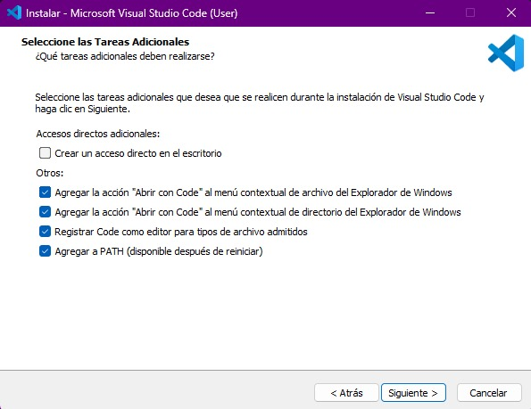

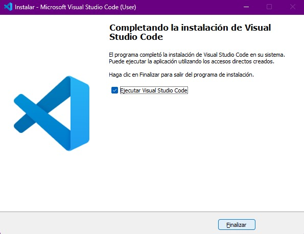

Y al final nos dice para iniciar.

De aquí pasamos a instalar python, [versión 3.11.7](https://www.python.org/downloads/release/python-3117/). Bajamos y escogemos 'Windows installer (64-bit).

Al inicio es importante la opción de abajo de agregar al path seleccionarla.

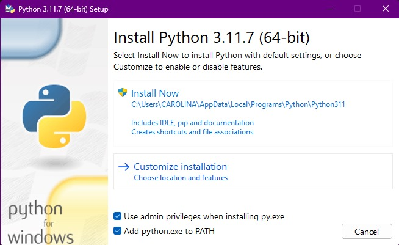

El resto es darle continuar y al final nos aparece así.

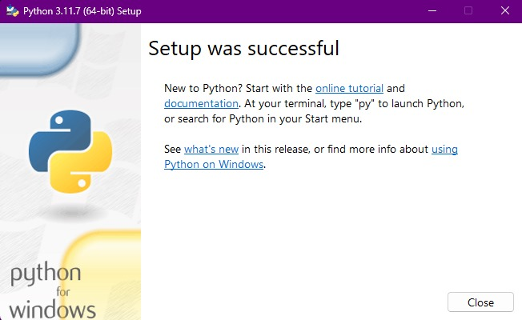

Luego, abrimos VScode y en la parte superior seleccionamos `Terminal` y `Nueva terminal`. Cuando abra abajo, ingresamos `pip install otree==5.10.2`.

> **Nota:** En algunos casos requiere reiniciar el computador para esto. Puede ser que sea mejor instalar también Git y al final reiniciar y proceder a instalar otree y django.

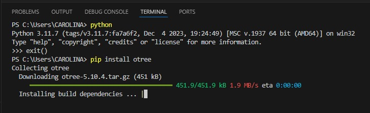

Cuando termine hacemos lo mismo para Django con `pip install django`.

Por último instalamos Git. 

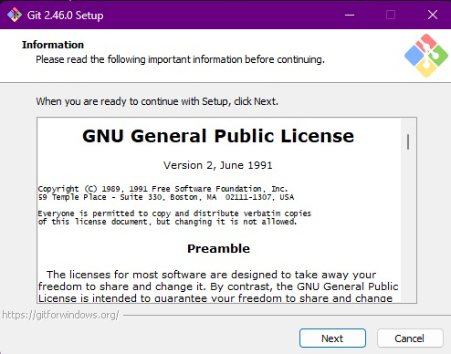

Es importante tener cuidado, en la tercera pantalla seleccionar a 'nano' como editor de texto. `Use the Nano editor by default`.

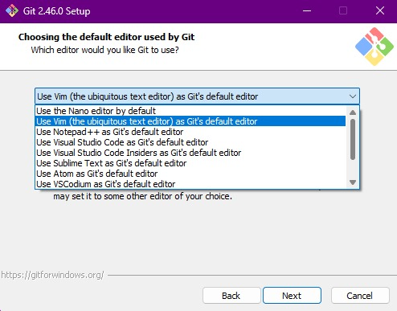

## MacOS

Descargamos VScode y al terminar damos doble click, nos extraerá el programa y ahora solo es arrastrarlo a la carpeta de Aplicaciones.

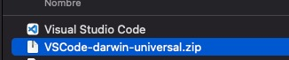

Luego, descargamos Python [versión 3.11.7](https://www.python.org/downloads/release/python-3117/), bajamos y escogemos 'macOS 64-bit universal2 installer' y al darle doble click al paquete, obtenemos:

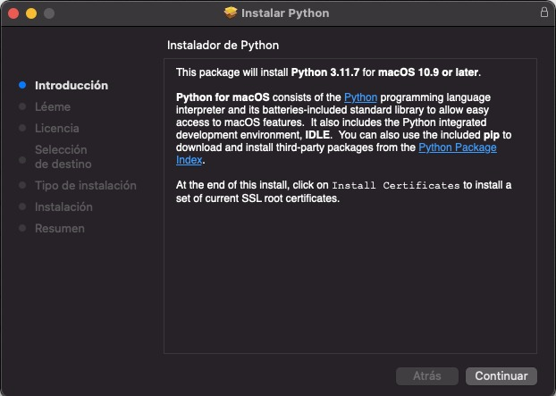

Solo es darle continuar y nos pide que si confiamos en la aplicación, damos que sí. Terminado, abrimos VScode y abrimos la terminal (arriba en el menú, terminal, nueva terminal).

La terminal abre abajo y escribimos `python3 --version`para validar que está instalado correctamente.

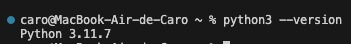

Ahora, tenemos que instalar el gestor de paquetes de python para instalar oTree y Django, para eso en la terminal escribimos `curl https://bootstrap.pypa.io/get-pip.py -o get-pip.py`.

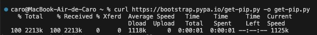

Terminado esto procedemos a instalar oTree escribiendo en la terminal `pip3 install otree==5.10.2`.

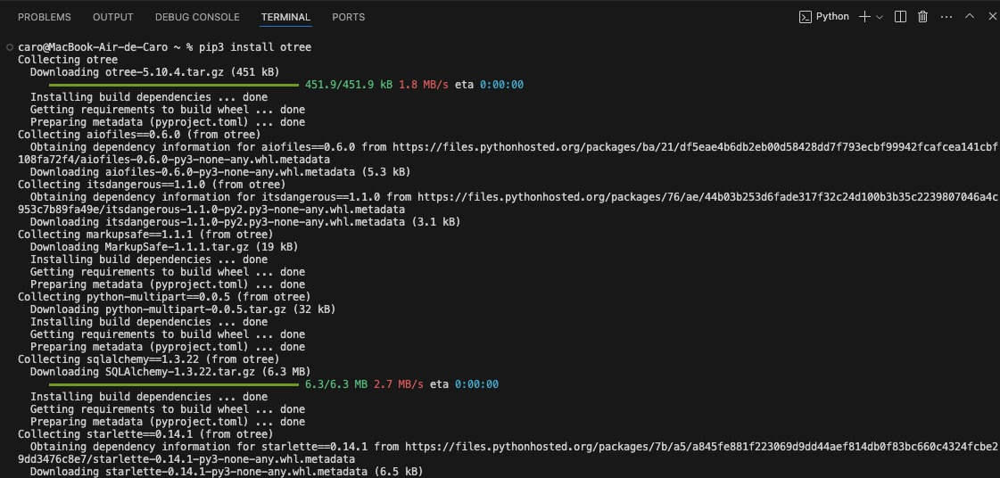

Al terminar hacemos lo mismo para instalar Django: `pip3 install django`.

## Descargar el repositorio de trabajo

Para esto creamos una carpeta en nuestra computadora, en la carpeta que queramos.
