# Trabajando con grupos

:wave: Hola!

En esta sesión crearemos 2 apps en las cuales los participantes se agruparán. Estos juegos son:

1. Public Goods Game <sup><a href="#bib_01">1</a></sup>
2. Trust Game <sup><a href="#bib_02">2</a></sup>

Entonces, manos a la obra:

## 1. Conociendo los juegos

Los juegos enumerados anteriormente tienen la particularidad de trabajar con grupos, que son creados por los participantes del experimento y son conformaddos de manera aleatoria, por lo cual cada participante no conocerá a los demás miembros de su grupo.

### 1.1. Public Goods Game

Es un juego en el cual se conforman grupos de una cantidad `N` de personas, todas anónimas.

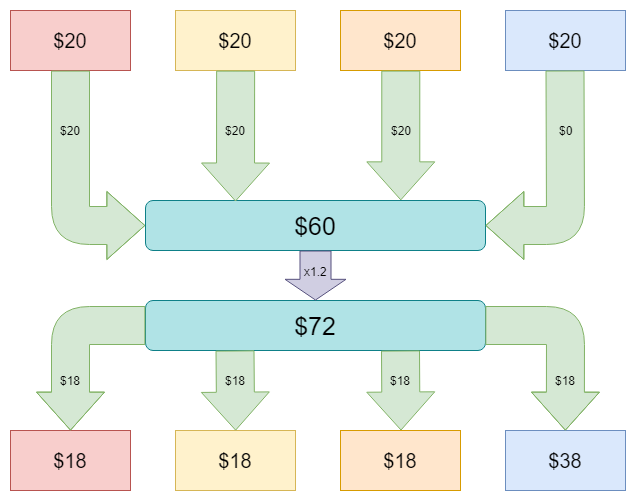 <sup><a href="#bib_01">1</a></sup>

Aquí se le da a cada participante una cantidad inicial de dinero para que lo aporte a una bolsa común o cuenta pública. Luego de que todos han aportado, el examinador o experimentalista _(en este caso nosotros)_ tomamos el dinero de la bolsa común y aplicamos un valor de multiplicación para posteriormente el dinero resultante se divida entre los miembros del grupo.

### 1.2. Trust Game

Es un juego para 2 personas que son emparejadas de manera aleatoria y son enumerados: jugador 1 y jugador 2. Al jugador 1 se le da una cantidad inicial de dinero.

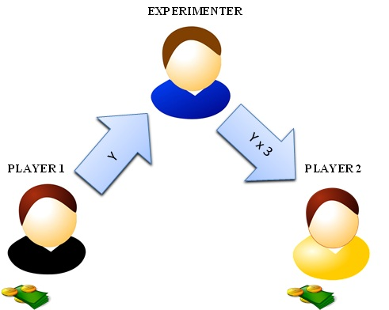 <sup><a href="#bib_02">2</a></sup>

Comienza con el jugador 1 enviando al jugador 2 una cantidad de dinero, la cual será multiplicada por un valor _(normalmente por 3)_. El jugador 2 obtiene ese monto y debe devolver al jugador 1 una cantidad entre 0 y el monto recibido.

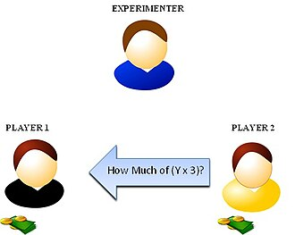 <sup><a href="#bib_02">2</a></sup>

Al final, cada uno de los jugadores recibirá:

- Jugador 1: Monto inicial - monto enviado a jugador 2 + monto recibido del jugador 2

- Jugador 2: (Monto recibido del jugador 1 * Multiplicador) + Monto enviado a jugador 1

## 2. Nuestro espacio de trabajo

Para comenzar a trabajar, es necesario descargar este repositorio, para ello usaremos `git`, por lo cual nos dirigimos a la terminal, en Visual Studio Code y escribimos `git clone https://github.com/sEF-uRosario/EX20242.git`.

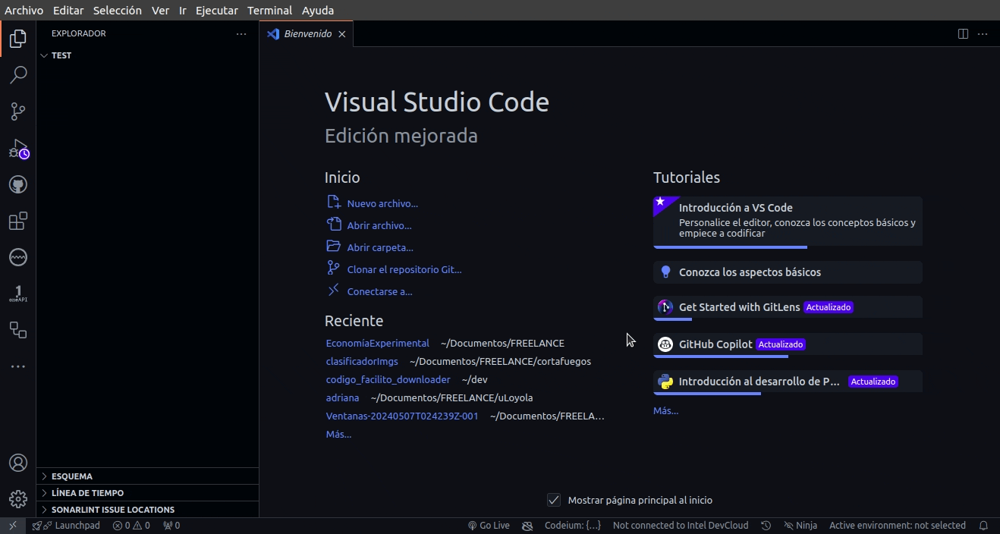

Esto nos descarga toda la carpeta donde trabajamos, donde tenemos las clases pasadas. Estando en Visual Studio Code abrimos la carpeta del curso que es `EX20242`, la carpeta `clases`, buscamos la sesión _`03_groups_publicGoods_trust_games`_ y allí la carpeta de cada uno.

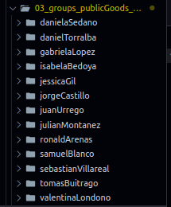

Damos click contrario _(normalmente es el click derecho)_ y presionamos en `Abrir en terminal integrado`.

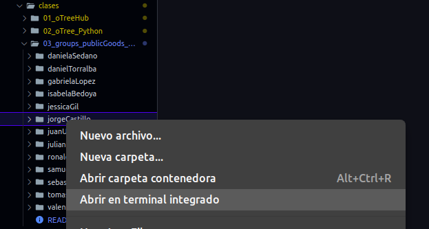

Y nos cargará una terminal en la parte inferior del vsCode.

## 3. Crear un proyecto

Para trabajar los juegos de la sesión usaremos un proyecto en el cual tengamos ambos _(ambas apps)_, para eso, estando ya en la terminal introducimos `otree startproject session_03` para crear un nuevo proyecto. Cuando nos pregunte que si queremos incluir juegos de ejemplo introducimos `n` _(que no)_.

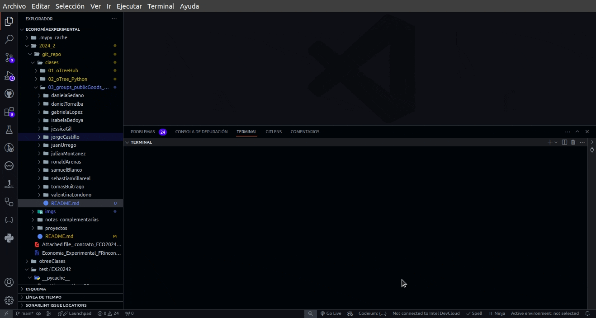

Y listo, ya tenemos nuestro proyecto para cargarle apps.

## 4. Crear apps

Como ya lo habíamos conversado en clase, los proyectos se componen de apps, que son los juegos que ustedes van a colocar dentro de sus experimentos. Para esto es necesario crearlos dentro del proyecto, por tal motivo necesitamos movernos a la carpeta del proyecto.

Para esto, vamos a la terminal e ingresamos `cd session_03` _(cd: change directory y session_03 que es el nombre del proyecto que acabamos de crear)_.

### 4.1. Public Goods Game App

Ya moviéndonos a la carpeta del proyecto mediante la terminal, ingresamos `otree startapp publicGoods` para crear nuestra app. oTree nos informará que se creó la carpeta _(o directorio)_ de la app.

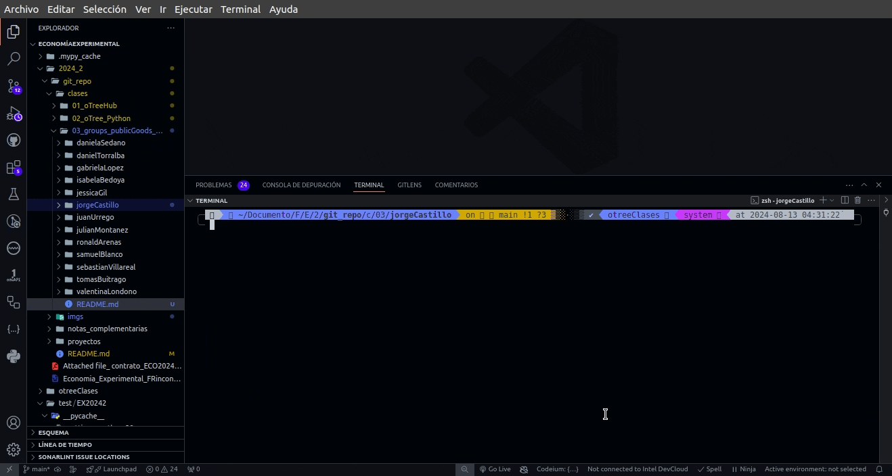

Si vamos al menú lateral izquierdo donde están las carpetas y abrimos la nuestra, podremos observar que:

- Se ha creado la carpeta del proyecto, llamada **'session_03'**.
- Se ha creado dentro una carpeta llamada **'publicGoods'** que es la respectiva a nuestra app.

Deberá ser algo similar a la siguiente imagen:


Y aquí ya trabajaremos en:

- Crear variables para almacenar datos.
- Crear páginas para recolectar, esperar a jugadores y visualizar los datos e información.
- Configurar la secuencia de las páginas creadas.
- Configurar el proyecto para mostrar un sesión con la app creada.

#### 4.1.1. Variables

Estando en nuestra carpeta `publicGoods` dentro está el archivo `__init__.py` en el cual manejaremos las variables.

Abrimos el archivo y encontraremos varias secciones, para crear variables de nivel global que nunca van a cambiar _(constantes)_, variables a nivel de sesión, subsesión, grupo y jugador.

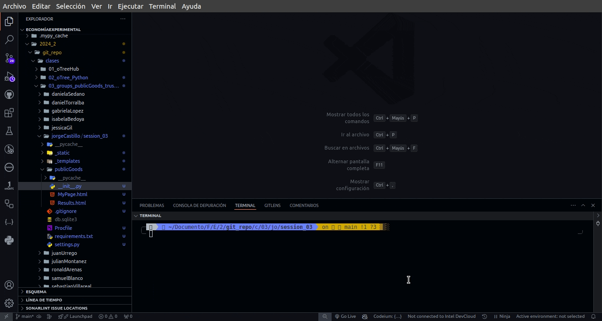

Procedemos a cambiar lo que dice la variable `doc` según la información que queramos colocar y que describa nuestra aplicación.

Luego, dentro de las Constantes `class C`, modificamos/agregamos:

```python
    PLAYERS_PER_GROUP = 3
    ENDOWMENT = cu(10000) 
    MULTIPLIER = 2
```

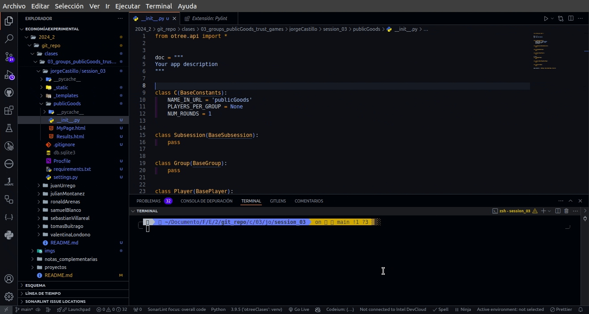

Posterior, dentro del modelo de Jugador `player`, eliminamos `pass` y agregamos:

```python
    contribution = models.CurrencyField(
        min = 0,
        max = C.ENDOWMENT,
        label = "Con cuánto dinero quiere contribuir a la bolsa común ?"
    )
```

Que nos crea una variable de tipo dinero, teniendo un valor mínimo de `0` y un máximo del valor colocado en Constantes, con un letrero que dice 'Con cuánto dinero quiere contribuir a la bolsa común ?' cuando se muestre a la persona.


Luego buscamos el Grupo `group` y dentro eliminamos `pass` colocando:

```python
    total_contribution = models.CurrencyField()
    individual_share = models.CurrencyField()
```

Lo cual nos crea 2 variables a nivel de grupo. `total_contribution` para almacenar la suma de la contribución de todas las personas del grupo, e `individual_share` para almacenar cuánto se le dará a cada uno de los jugadores. Ambas variables son del tipo dinero.

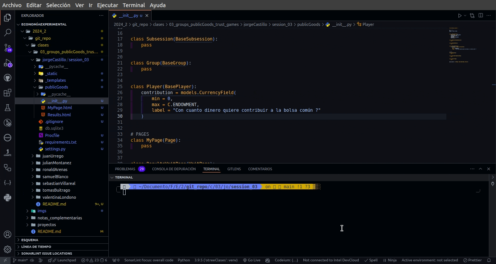

#### 4.1.2. Páginas

Este juego está compuesto de 3 páginas. Para cada página es necesario 2 acciones: crear el archivo `.html` y crear la clase dentro del archivo `__init__.py`.

La primera en donde se le pregunta a cada jugador cuánto piensa aportar. Para eso creamos dentro de la carpeta `publicGoods` un archivo, haciendo click contrario y nuevo archivo. Colocamos por nombre `Contribucion.html`.

> **Importante:** Los nombres de los templates se recomienda que comiencen con mayúscula.

Luego, abrimos el archivo `MyPage.html` y copiamos su contenido y lo pegamos dentro de `Contribucion.html`, modificando el título y el contenido, quedando el código así:

```html
{{ block title }}
    Contribución por jugador
{{ endblock }}
{{ block content }}

    <p>
        Este juego de cuentas públicas tiene {{ C.PLAYERS_PER_GROUP }} jugadores por grupo y cada jugador tiene un monto inicial de {{ C.ENDOWMENT }} y hay un multiplicador de {{ C.MULTIPLIER }}.
    </p>

    {{ formfields }}
    
    {{ next_button }}

{{ endblock }}
```


Y luego volvemos al archivo `__init__.py` y vamos hasta el final donde está la sección de `#PAGES` y al final agregamos nuestra página. El nombre de la clase debe ser el mismo del archivo `.html`.

```python
    form_model = "player"
    form_fields = ["contribution"]
```

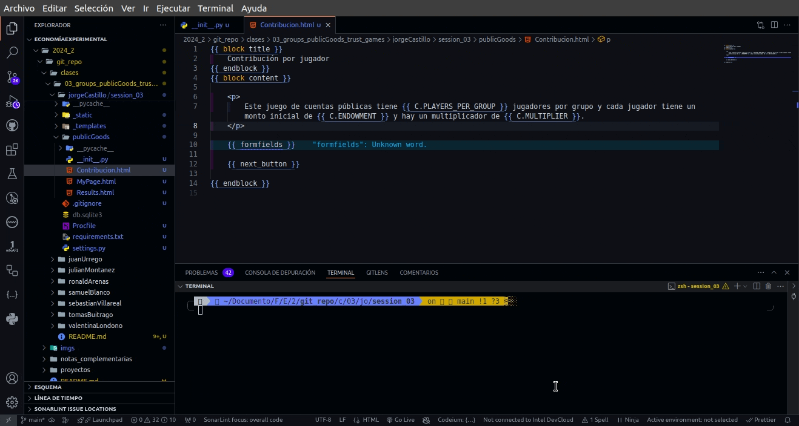

Con esto le decimos que el formulario va a estar relacionado con las variables del Jugador `player` y se va a solicitar el dato `contribution` que previamente hemos creado.

Continuamos y sigue la página de espera. Para esto, primero vamos a crear una sección dentro de `__init__.py` que se llame `#FUNCTIONS` en donde haremos toda nuestra lógica, de ser necesaria.

Creamos una función que se llame `set_payoff` la cual nos establecerá los pagos para cada jugador. Al final, la función nos quedaría así:

```python
## FUNCTIONS

def set_payoffs(group):
    players = group.get_players()
    contributions = [p.contribution for p in players]
    group.total_contribution = sum(contributions)
    group.individual_share = (group.total_contribution * C.MULTIPLIER) / C.PLAYERS_PER_GROUP
    for p in players:
        p.payoff = C.ENDOWMENT - p.contribution + group.individual_share
```


En donde lo que hacemos es obtener todos los jugadores del grupo, después obtenemos la contribución de cada jugador y la colocamos dentro de una lista, obtenemos el total de la contribución sumando la contribución individual y posteriormente la dividimos teniendo en cuenta el factor multiplicador y la cantidad de jugadores en el grupo.

Al final, lo que hacemos es visitamos, o recorremos cada uno de los jugadores y a la variable `payoff` que por defecto tiene oTree le asignamos el valor respectivo a pagársele.

Para que funcione, vamos a tomar una página de espera y colocar que cuando todos lleguen, llame a esta función. Esto lo haremos dentro de la clase ya creada `ResultsWaitPage` y usamos la expresión `after_all_players_arrive` asignándole el nombre de la función que creamos anteriormente.

```python
class ResultsWaitPage(WaitPage):
    after_all_players_arrive = set_payoffs
```


Por último nos quedaría la página para mostrarle a cada jugador cuánto le correspondería. Para esto, usaremos la página ya creada por oTree que es el archivo `Results.html`. Lo abrimos y modificamos cambiando su título y colocando un detallado del pago _(cosa importante)_. El código en este archivo quedaría así:

```html
{{ block title }}
    Resultados obtenidos
{{ endblock }}

{{ block content }}

    <p>
        Usted inicio el juego con {{ C.ENDOWMENT }}.
        De este valor, usted contribuyó con {{ player.contribution }}.
        En total, en todo su grupo se recogió {{ group.total_contribution }}.
        Por lo tanto, a cada jugador le corresponde de la repartición {{ group.individual_share }}.
        Y a usted, le corresponde un pago de {{ player.payoff }}.
    </p>

    {{ next_button }}
    
{{ endblock }}
```


Y ya, nada más. No necesitamos modificar la clase `Results` en `__init__.py` porque no tenemos que recoger datos ni realizar ningún procedimiento _(calcular, escoger, capturar, etc)_.

#### 4.1.3. La secuencia de las páginas

Ya con las variables creadas y las páginas respectivas igualmente, tenemos que decirle a oTree que nos muestre las páginas en un orden específico.

Para esto, vamos al final de `__init__.py` en donde encontramos la lista `page_sequence`. Aquí la modificamos para que quede con el nombre de nuestras páginas _(el nombre de las clases, respectivamente)_.

```python
page_sequence = [Contribucion, ResultsWaitPage, Results]
```

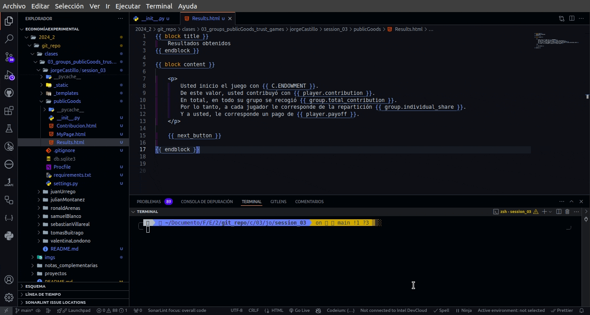

#### 4.1.4. Configuración de la sesión

Lo último que nos queda es configurar la sesión. Para esto vamos a la carpeta del proyecto, que es `session_03` y buscamos el archivo `settings.py`.

Aquí modificamos la variable `SESSION_CONFIGS` agregando un diccionario con la información de nuestra sesión, quedando así:

```python
SESSION_CONFIGS = [
    dict(
        name = "publicGoods",
        display_name = "Public Goods",
        app_sequence = ["publicGoods"],
        num_demo_participants = 3
    )
]
```

Más abajo cambiamos el idioma de `en` a `es` para que los botones e información de oTree aparezca en español. Por último cambiamos el tipo de moneda de `USD` a `COP`.


#### 4.1.5. Pruebas - Servidor local

Ya teniendo nuestra app nos queda probarla. Para esto vamos a la terminal que está abajo en nuestro Visual Studio Code, e ingresamos el comando `otree devserver`. Comprobar que aparezca que estamos en la carpeta `session_03`.

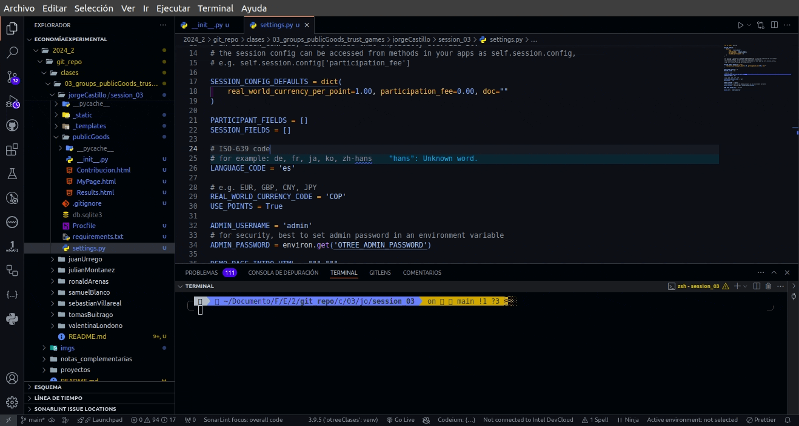

> **Importante:** En algunos casos al ejecutar aparece el mensaje `oTree has been updated. Please delete your database (db.sqlite3)` y solo basta con borrar el archivo y volver a dar la instrucción en la terminal.

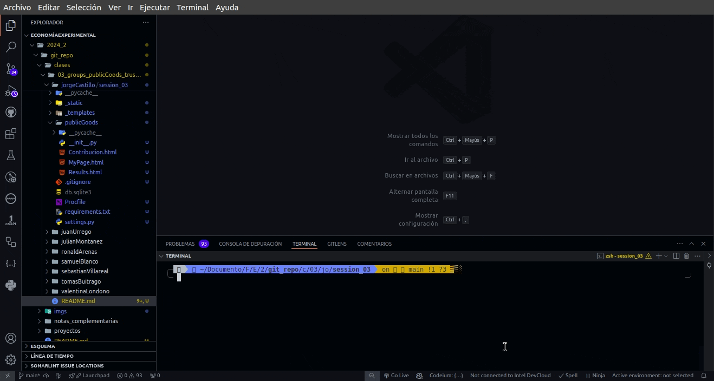

Y ya cuando nos diga que está todo listo, abrimos un navegador y entramos a la dirección `localhost:8000` y escogemos nuestra sesión, y empezamos a interactuar.


### 4.2. Trust Game

Ya teniendo nuestra primera sesión con una app, vamos a crear la segunda sesión con la app de **Trust Game**. Al igual que la anterior, haremos el paso a paso y lanzaremos igual que con el juego anterior.

Para esto, primero debemos situarnos en la carpeta del proyecto, que es `session_03` y en la terminal escribir `otree startapp trust`. Nos crea la carpeta con todo lo necesario para iniciar nuestra nueva app.

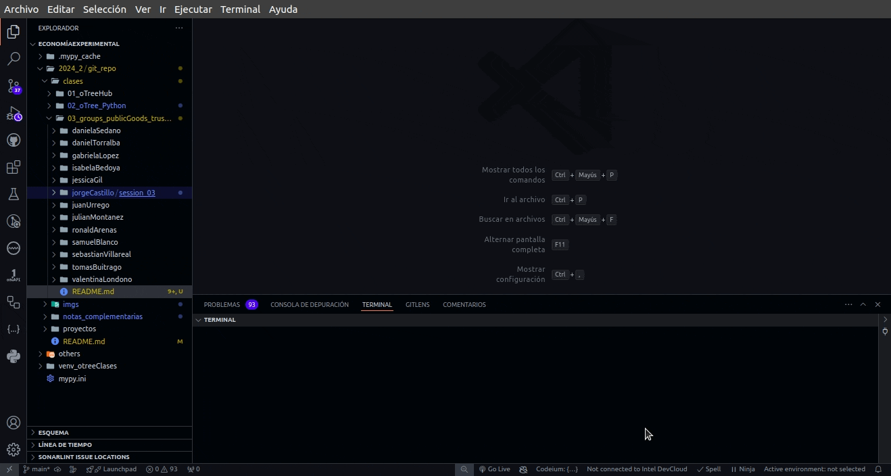

#### 4.2.1. Variables

Ya teniendo la carpeta creada, vamos a `__init__.py` en donde iniciamos a crear nuestras variables.

##### 4.2.1.1. Constantes

En constantes vamos a colocar lo siguiente:

```python
class C(BaseConstants):
    NAME_IN_URL = 'trust'
    PLAYERS_PER_GROUP = 2
    NUM_ROUNDS = 1
    ENDOWMENT = cu(1000)
    MULTIPLIER = 3
```


En donde decimos que los grupos van a ser de 2 jugadores, una única ronda, el valor inicial es de 10.000 y el factor de multiplicación es de 3.

##### 4.2.1.2. Jugador

No hay variables a nivel de jugador ... La pregunta es ¿por qué? 

##### 4.2.1.3. Grupo

En grupo vamos a crear 2 variables: el dinero enviado y el dinero devuelto.

```python
class Group(BaseGroup):
    dinero_enviado = models.CurrencyField(
        min = 0,
        max = C.ENDOWMENT,
        label = "Cuánto dinero quiere enviar al jugador 2?"
    )
    dinero_devuelto = models.CurrencyField(
        label = "Cuánto dinero del recibido quiere devolver al jugador 1?
    )
```


#### 4.2.2. Funciones

Las funciones adicionales que requerimos para nuestro juego, son 2:

```python
# FUNCTIONS
def dinero_devuelto_choices(group: Group):
    return currency_range(0, group.dinero_enviado * C.MULTIPLIER, 1)


def set_payoffs(group: Group):
    p1 = group.get_player_by_id(1)
    p2 = group.get_player_by_id(2)
    p1.payoff = C.ENDOWMENT - group.dinero_enviado + group.dinero_devuelto
    p2.payoff = group.dinero_enviado * C.MULTIPLIER - group.dinero_devuelto
```

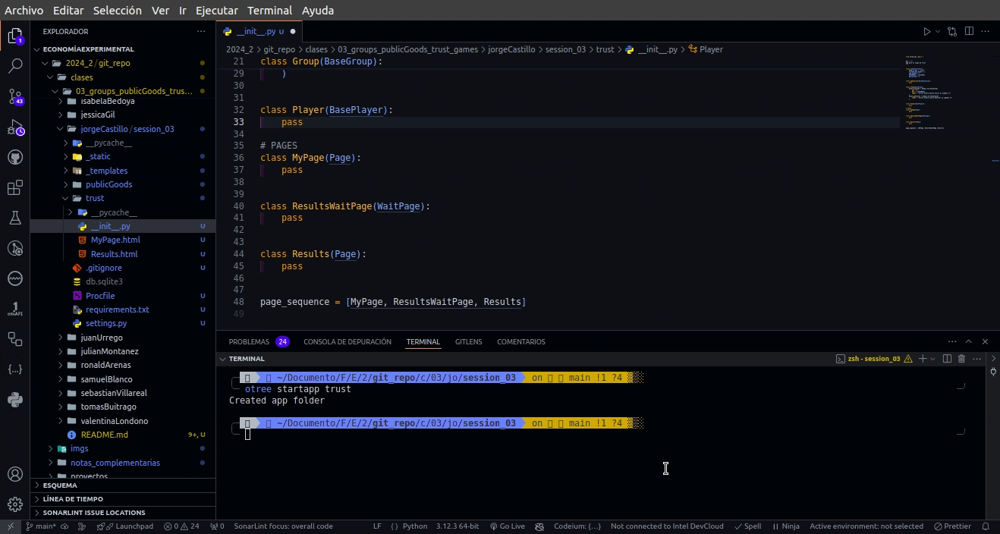

La función `sent_back_amount_choices` nos establece un rango para el jugador 2 de opciones de dinero a devolver, teniendo en cuenta el dinero que le llegó del jugador 1.

La función `set_payoffs` establece el valor a pagarle a cada jugador.

Estas dos funciones las agregamos a nuestro archivo `__init__.py` antes de la sección de `#PAGES`.

#### 4.2.3. Páginas

En cuanto a las páginas necesitamos 6: una de instrucciones, una para enviar el dinero, otra para devolver el dinero, la de resultados y dos de espera.

##### 4.2.3.1. Instrucciones

Para las instrucciones creamos el archivo `Instrucciones.html` dentro de la carpeta `trust` y agregamos el siguiente código:

```html
{{ block content }}

<div class="card bg-light m-3">
    <div class="card-body">

    <h3>
        Instrucciones
    </h3>
    <p>
        Este juego es para 2 participantes y se llama 'Juego de Confianza'.
    </p>
    <p>
        Al iniciar el jugador 1 recibe {{ C.ENDOWMENT }} mientras el jugador 2 no recibe nada.
    </p>
    <p>
        El jugador 1 puede enviar algo, todo o nada de {{ C.ENDOWMENT }} al jugador 2.
    </p>
    <p>
        El monto enviado por el jugador 1 al jugador 2 se multiplicará por {{ C.MULTIPLIER }} y esa será la cantidad recibida por el jugador 2.
    </p>
    <p>
        Después de recibida, el jugador 2 decidirá el monto a devolverle al jugador 1, si todo lo recibido, una parte o nada.
    </p>
    <p>
        Al final con el monto que cada uno termine será el valor en dinero que se le pagará.
    </p>
    </div>
</div>

    {{ next_button }}

{{ endblock }}
```

Y en el archivo `__init__.py` en la sección `#PAGES` agregamos:

```python
class Instrucciones(Page):
    pass
```

Con esto le mostramos a los participantes una información inicial sobre el juego.

##### 4.2.3.2. Enviar dinero

Para esta página creamos el archivo `Enviar.html` y dentro colocamos el código:

```html
{{ block title }}
    Enviar Dinero
{{ endblock }}
{{ block content }}

    <p>
        Tú eres el jugador 1. Actualmente tienes {{ C.ENDOWMENT }}.
    </p>

    {{ formfields }}

    {{ next_button }}

{{ endblock }}
```

Y en el archivo `__init__.py` en la sección `#PAGES` agregamos:

```python
class Enviar(Page):
    form_model = "group"
    form_fields = ["dinero_enviado"]
    
    @staticmethod
    def is_displayed(player: Player):
        return player.id_in_group == 1
```

En donde decimos que los datos son del nivel de grupo, que el campo a pedir es el de la cantidad de dinero a enviar, y que muestre esta página solo al jugador con el ID igual a 1.

##### 4.2.3.3. Página espera 1

Mientras el jugador 1 llena el valor a enviar, el jugador 2 debe estar esperando, por ello es necesario crear esta página de espera. Como oTree tiene por defecto unos, lo que haremos es agregar al archivo `__init__.py` lo siguiente:

```python
class EsperaJ1(WaitPage):
    pass
```

##### 4.2.3.4. Devolver el dinero

Ahora, después de que el jugador 1 ha enviado la cantidad al jugador 2, este debe colocar un valor a devolver. Para ello creamos el archivo `Devolver.html` y que tendrá el código:

```html
{{ block title }}
    Devolver Dinero
{{ endblock }}
{{ block content }}

    <p>
        Tú eres el jugador 2. El jugador 1 te ha enviado {{ group.dinero_enviado }} y al multiplicarlo usted recibirá {{ dinero_multiplicado }}.
    </p>

    {{ formfields }}

    {{ next_button }}

{{ endblock }}

```

Y en el archivo `__init__.py` en la sección `#PAGES` agregamos:

```python
class Devolver(Page):
    form_model = "group"
    form_fields = ["dinero_devuelto"]
    
    @staticmethod
    def is_displayed(player: Player):
        return player.id_in_group == 2

    @staticmethod
    def vars_for_template(player: Player):
        group = player.group
        return dict(dinero_multiplicado = (group.dinero_enviado * C.MULTIPLIER))
```

##### 4.2.3.5. Espera al jugador 2

Ahora, el jugador 1 debe esperar a que el jugador 2 tome una decisión. Para ello colocaremos una página de espera en `__init__.py` de la siguiente manera:

```python
class EsperaJ2(WaitPage):
    after_all_players_arrive = set_payoffs
```

De paso para que calcule para cada jugador su ganancia.

##### 4.2.3.6. Resultados

Ya después de escogida la cantidad de dinero a devolver, se le debe mostrar a cada jugador los resultados y cuánto será el dinero que obtuvo.

Para esto usaremos la página ya creada de `Results.html`. Dentro, nuestro código quedaría:

```html
{{ block title }}
    Resultados
{{ endblock }}

{{ block content }}

    {{ if player.id_in_group == 1 }}
        <p>
            Tú enviaste al jugador 2 {{ group.dinero_enviado }}.
            El jugador 2 devolvió {{ group.dinero_devuelto }}.
        </p>
    {{ else }}
        <p>
            El jugador 1 te envió {{ group.dinero_enviado }}.
            Tú le devolviste {{ group.dinero_devuelto }}.
        </p>

    {{ endif }}

    <p>
        Entonces, el total tuyo es {{ player.payoff }}.
    </p>

    {{ next_button }}

{{ endblock }}
```

Aquí lo primero es que se diferencia entre el jugador 1 y el jugador 2 para que muestre diferente mensaje. Luego de esto muestra lo que ganó ese jugador.

#### 4.2.4. Crear sesión

Ahora crearemos la sesión para esta app.

Nos dirigimos al archivo `settings.py` en la carpeta `session_03` y en la variable `SESSION_CONFIGS` debajo de lo que ya existe dentro de esta agregamos esta nueva.

Al final, nos debería quedar así:

```python
SESSION_CONFIGS = [
    dict(
        name = "publicGoods",
        display_name = "Public Goods",
        app_sequence = ["publicGoods"],
        num_demo_participants = 3
    ),
    dict(
        name = "trust",
        display_name = "Trust",
        app_sequence = ["trust"],
        num_demo_participants = 2
    ),
]
```

#### 4.2.5. Testear

Ya terminado todo lo anterior, solo queda testear nuestra app.

Para eso vamos a nuestra terminal y corroboramos que estemos en la carpeta del proyecto que es `session_03` y presionamos `otree devserver` y abrimos en un navegador web.


## 5. Enviar el código

Estando en la carpeta el proyecto, que es `session_03` nos dirigimos a la terminal y allí después de comprobar que nuestro proyecto funciona bien, escribimos `otree zip` lo cual nos generará el archivo `.otreezip` para enviar.

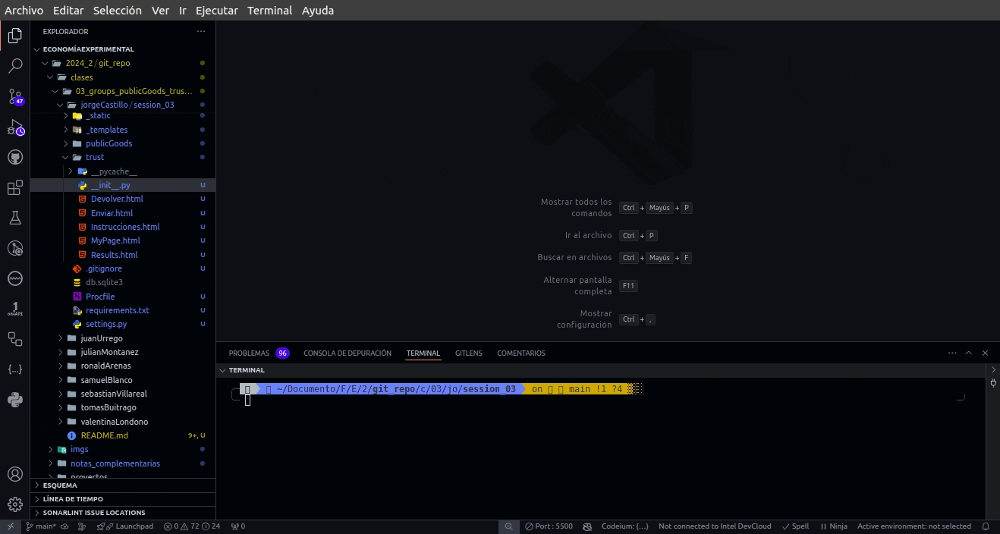

## 6. Ayudas

Si en algún momento tienen problemas con el código pueden recurrir al código creado por el asistente docente como guía => [Código Jorge](jorgeCastillo/session_03/) en donde están los archivos usados para esta guía.

Si tienes problemas de alguna otra índole, puedes generar una _issue_ según lo indica la guía [Levantar una issue técnica](../../notas_complementarias/02_Generar_Issue_GitHub.md). Recordar anexar imágenes, detallar el problema presentado. Allí le será resulta la inquietud o problema y de paso quedará registro por si alguno de sus compañeros llega a presentar algo igual.

<hr>

## 7. Bibliografía

<ol>
    <li id="bib_01"> Wikipedia, “Public goods game,” Wikipedia. [Online]. Available: <a href="https://en.wikipedia.org/wiki/Public_goods_game">https://en.wikipedia.org/wiki/Public_goods_game.</a> [Accessed: 11-Aug-2024].
    <li id="bib_02"> Wikibooks, “Trust Game,” Bestiary of Behavioral Economics. [Online]. Available: <a href="https://en.wikibooks.org/wiki/Bestiary_of_Behavioral_Economics/Trust_Game">https://en.wikibooks.org/wiki/Bestiary_of_Behavioral_Economics/Trust_Game.</a>. [Accessed: 11-Aug-2024].
    <li id="bib_03"> oTree, “Part 2: Public goods game,” oTree Documentation. [Online]. Available: <a href="https://otree.readthedocs.io/en/master/tutorial/part2.html">https://otree.readthedocs.io/en/master/tutorial/part2.html</a>. [Accessed: 11-Aug-2024].
    <li id="bib_04"> oTree, “Part 3: Trust game,” oTree Documentation. [Online]. Available: <a href="https://otree.readthedocs.io/en/master/tutorial/part3.html">https://otree.readthedocs.io/en/master/tutorial/part3.html.</a>. [Accessed: 11-Aug-2024].
</ol>