# Entendiendo oTree Parte 1: Session, Subsession, Group, Player - Guess 2/3

Después de haber desarrollado en nuestra [sesión anterior](../03_groups_publicGoods_trust_games/README.md) 2 juegos, haberlos ejecutado y capturar datos, podemos observar trabajo en grupos.

Ahora vamos a hacer un análisis mejor de cómo es el funcionamiento, de manera jerárquica, de las variables, grupos, el experimento en general, etc.

Para esto tendremos:

1. <a href="#sesión">Sesión</a>
2. Subsesión
3. Grupo
4. Página
5. Participante
6. Jugador

Los 4 primeros se pueden agrupar como maneras en que se pueden visualizar y asociar la interacción _(Sesión, Subsesión, Grupo, Página)_ mientras los dos últimos se trata sobre las personas _(Participante, Jugador)_.

## Por interacción

Como ya se ha mencionado una de las maneras en que se establece una interacción es a través de la sesión, subsesión, grupo o página.

Esta interacción, **y es muy importante** tiene que ver con la lógica del negocio _(en palabras de un desarrollador, programador o ingeniero de sistemas)_ o sea, con cómo se es el paso a paso, el actuar / accionar, los datos que se esperan recoger, el momento / tiempo, etc.

Una gráfica que nos puede ayudar a entender esto sería la siguiente:

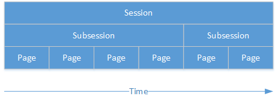<sup><a href="#bib_01">1</a></sup>

### Sesión

La sesión es todo el evento que consiste en un experimento completo. Durante este varios participantes realizan una serie de juegos, actividades o aplicaciones.

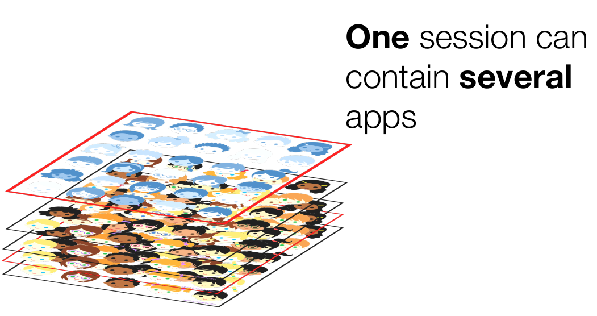<sup><a href="#bib_02">2</a></sup>

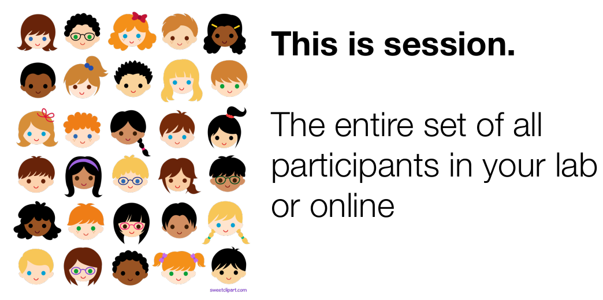<sup><a href="#bib_02">2</a></sup>

Una sesión puede contener una cantidad `n` de juegos o aplicaciones ordenadas _(recuerden 'app_sequence' en el archivo `settings.py`)_.

Un ejemplo de una sesión sería citar a varios participantes y que realicen un juego de bienes públicos, seguidos de un juego de confianza y terminando en una encuesta _(3 aplicaciones en total: 2 juegos + encuesta)_.

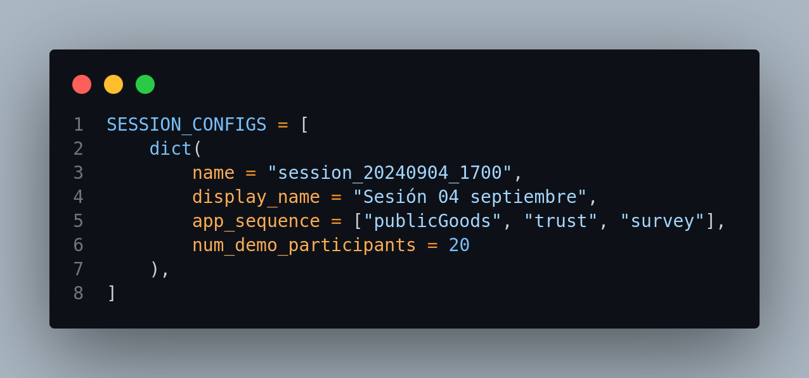

### Subsesión

Cada subsesión es cada una de las aplicaciones o juegos o actividades que hagan parte de la sesión, y por ronda. O sea si tuviésemos un juego de confianza y se hacen 2 rondas de este, habrían 2 subsesiones de este juego.

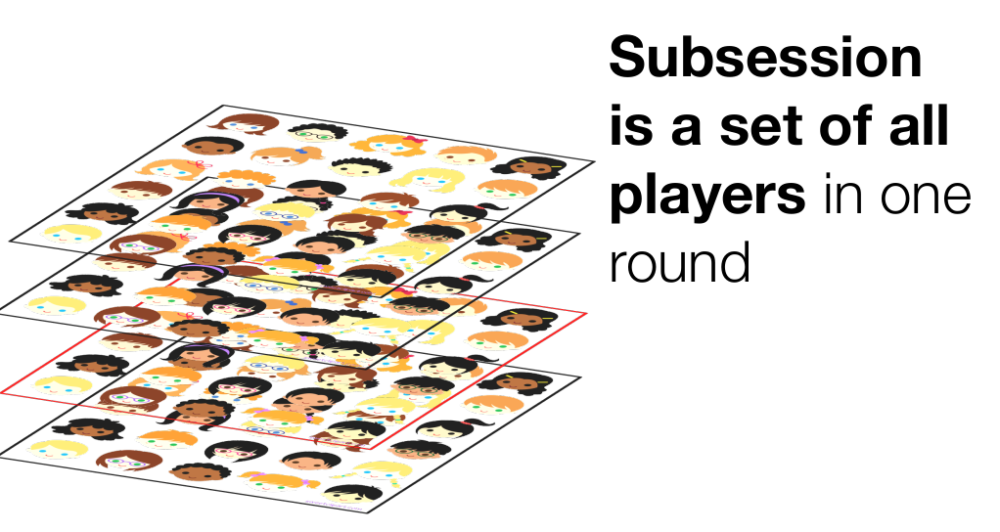<sup><a href="#bib_02">2</a></sup>

### Grupo

Un grupo es un conjunto de jugadores de una subsesión.

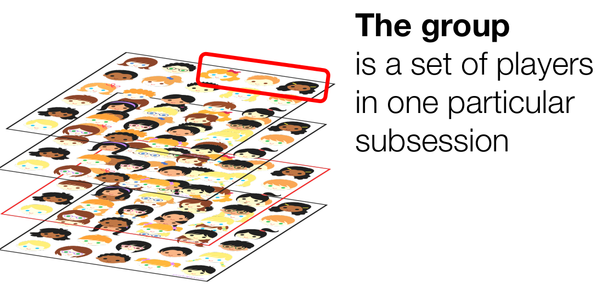<sup><a href="#bib_02">2</a></sup>

Por ejemplo, si tenemos una subsesión con 20 jugadores y formamos grupos de 2 personas para le juego de confianza, se forman 10 grupos. A cada jugador dentro del grupo se le puede dar un identificador dentro de este _(jugador # 1, jugador # 2, jugador # 3)_ pero que es exclusivo dentro de ese grupo.

> **Nota:** Los grupos se pueden aleatorizar entre cada subsesión, sin importar que sean el mismo juego. Siguiendo con el juego de confianza de 2 rondas, las parejas para cada ronda se pueden aleatorizar, entonces, para la primera ronda se puede formar un grupo con los jugadores A - B y otro con los jugadores C - D; pero para la ronda 2 los grupos pueden ser A - D y B - C.

### Página

Es la unidad más mínima de interacción y como su nombre lo dice, es cada una de las páginas que vemos, con la que los jugadores interactúan.

En estas se colocan los formularios para capturar los datos, se ponen tablas para visualizar información, letreros y etiquetas para obtener retroalimentación, etc.

Son nuestros archivos en formato `.html` y dentro de los cuales usamos llaves para llamar variables o interactuar con estas: `{{ formfields }}`, `{{ player.edad }}`, `{{ C.MULTIPLIER }}`, `{{ group.total_contribution }}`, etc.

## Por persona

Otra jerarquía que existe en oTree es por personas, en donde es importante tener en cuenta que Participante y Jugador están relacionados pero no son iguales porque uno contiene al otro _(el participante contiene al jugador)_.

<sup><a href="#bib_01">1</a></sup>

### Participante

El participante es la persona que asiste al laboratorio y es la misma a lo largo de toda la sesión sin importar subsesión o aplicaciones o rondas.

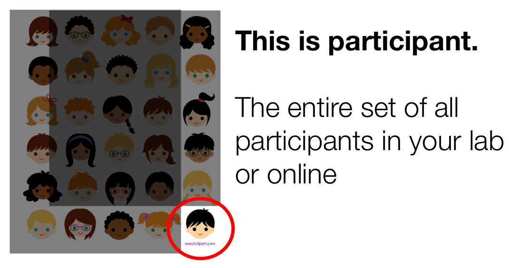<sup><a href="#bib_02">2</a></sup>

Lo ideal es identificar al participante mediante un código o ID para tener en cuenta al final y poder relacionar la recompensa a pagarle, para el consentimiento, etc.

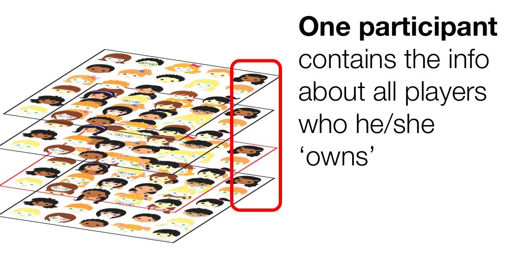<sup><a href="#bib_02">2</a></sup>

### Jugador

El jugador es el nombre que se le da al participante durante cada subsesión.

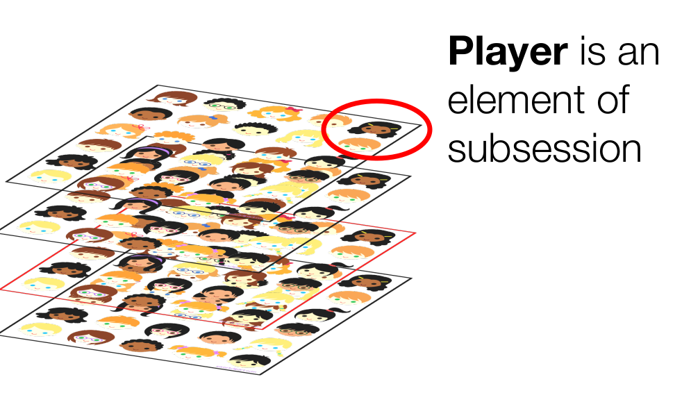<sup><a href="#bib_02">2</a></sup>

Como cada subsesión es diferente _(porque es una aplicación diferente, es una ronda diferente, es una encuesta, etc)_ es aquí donde usamos dentro del archivo `__init__.py` la parte de **Player** para generar variables en donde vamos a guardar los datos a recolectar de la interacción de la persona.

## Actividad Práctica: Adivinando 2/3 del promedio

Para poner en práctica los conceptos vistos, vamos a realizar un juego conocido como 'Adivina 2/3 del promedio' _(Guess 2/3 of the average)_. <sup><a href="#bib_03">3</a></sup> Aquí se tiene una cantidad de jugadores por grupo, y a cada jugador se le da la oportunidad que de un número entre 0 y el valor máximo, luego se calcula 2/3 del promedio de los números del grupo, y quien más se acerque se lleva el premio.

Entonces comencemos:

### Actualizando nuestro repositorio local

Para comenzar debemos actualizar lo que está en nuestra computadora. Para esto vamos a usar `git` que ya habíamos instalado anteriormente.

Entonces, abrimos nuestro Visual Studio Code, revisamos que estemos en la carpeta donde trabajamos normalmente _(por defecto llamada 'EX20242')_.

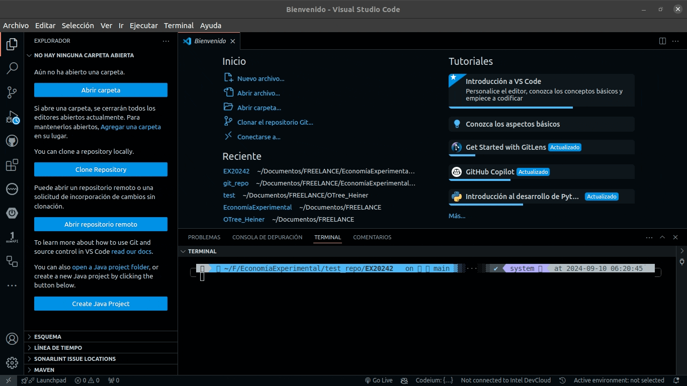

Revisamos que estén las carpetas de todo el repositorio, entre esto la carpeta con nuestro nombre _(y en donde trabajamos la sesión pasada)_.

Luego, procedemos a ir a la barra superior, al menú Terminal -> Nuevo Terminal y abajo en el terminal ingresamos el comando:

`git pull origin main`

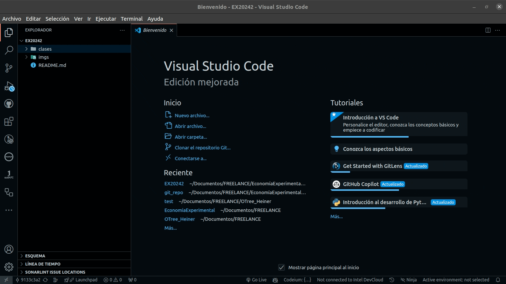

Con esto nuestro repositorio debería actualizarse y mostrarnos ahora en el panel izquierdo la carpeta `04_entendiendo_oTree_parte01` y dentro una carpeta con el nombre de cada estudiante.


Ya estando aquí podremos proceder a crear el proyecto.

### Creando el proyecto y la app

Para crear el proyecto para esta sesión de trabajo, vamos a la carpeta con nuestro nombre, presionamos click contrario sobre esta y al desplegar el menú escogemos 'Abrir en terminal integrado'.

Se nos abrirá un terminal, en donde vamos a crear el proyecto 'session_04' escribiendo el comando

`otree startproject session_04`

Nos preguntará si queremos que incluya los juegos de ejemplo y le decimos que no `n`.

Y luego nos movemos a la carpeta del proyecto escribiendo en la terminal

`cd session_04`

Ya estando dentro de la carpeta del proyecto, vamos a crear la app con la que trabajaremos, escribiendo en la terminal

`otree startapp guess_2_3`

Y revisamos en el panel izquierdo que se hayan creado las carpetas y los archivos respectivos.

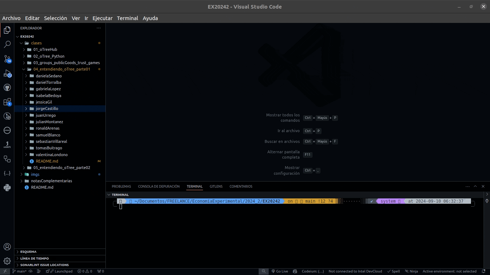

Lo primero que vamos a realizar es eliminar los archivos `.html` que crea por defecto porque no los vamos a usar.

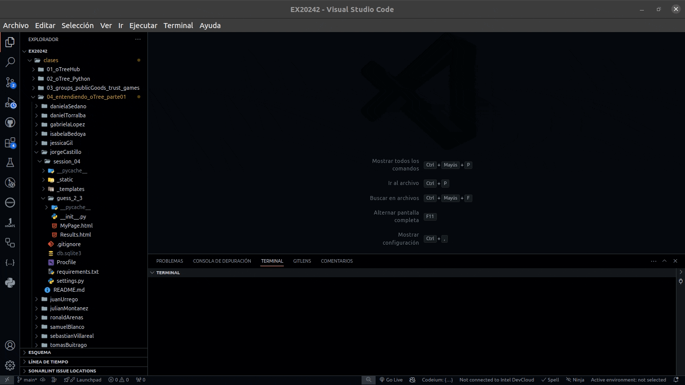

Comenzaremos por crear las variables a usar, o sea los 'models'. Aquí es importante tener en cuenta lo visto en cuanto a la jerarquía y la 'lógica del negocio' del juego o actividad a desarrollar para saber si se crean en Constantes, Subsesión, Grupo o Jugador.

> **Pregunta:** ¿ Y para guardar datos en Participante ? _punto extra_

Luego vamos a crear los 'templates' que vamos a usar para mostrarle a los participantes instrucciones, para recolectar los valores de cada uno y para terminar quién ganó y cuánto.

Y por último trabajamos sobre 'pages' y 'functions' según si hay necesidad.

#### Models

Para las variables, comenzaremos con las que son Constantes. Aquí debemos definir la cantidad de jugadores, cantidad de rondas, el valor máximo para hacer la estimación y la cantidad de puntos _(o dinero según se configure/establezca)_ a dar al ganador.

Entonces, en `class C` quedaría así:

```python
class C(BaseConstants):
    # Necesarias para el juego
    PLAYERS_PER_GROUP = 3 # Van a ser 3 jugadores por grupo
    NUM_ROUNDS = 3 # Van a ser 3 rondas en total del juego
    NAME_IN_URL = 'guess_2_3' # Nombre que se colocará en la URL (navegador web) para el juego
    # Dependientes del juego
    VALOR_MAXIMO = 100 # Cada jugador podrá colocar un valor entre 0 y 100
    BOTE_GANANCIAS = cu(10000) # El jugador que quede más cerca del valor promedio ganará 10.000 puntos
```

Siguiendo la lógica del juego, no van a existir variables a nivel de Subsesión.

En cambio a nivel de grupo si deberían existir variables, esto debido a que los jugadores se agrupan y son necesarias para calcular el promedio de los 2/3, obtener la mejor estimación y la cantidad de ganadores _(por si hay varios, toca repartir el bote de ganancias)_. Siendo así, `class Group` quedaría:

```python
class Group(BaseGroup):
    dos_tercios_promedio = models.FloatField() # Para almacenar los dos tercios del promedio
    mejor_estimacion = models.IntegerField() # Para almacenar la mejor estimación de los jugadores
    n_ganadores = models.IntegerField() # Para almacenar la cantidad de ganadores
```

Lo siguiente sería a nivel de jugador, donde por cada jugador requeriremos obtener la estimación que cada uno da, si es o no ganador. Para eso, nos dirigimos a `class Player` y nos encargamos de que quede así:

```python
class Player(BasePlayer):
    estimacion = models.IntegerField(
        min = 0, # Aquí el valor mínimo que puede ingresar un jugador es 0
        max = C.VALOR_MAXIMO, # Con esto se establece que el valor máximo que puede ingresar un jugador es el establecido arriba en constantes como 'VALOR_MAXIMO'
        label = "Escoja un valor entre 0 y 100:" # Es lo que se va a mostrar al jugador cuando vaya a ingresar su estimación
    )
    es_ganador = models.BooleanField(initial = False) # Es para almacenar si un jugador fue ganador o no
```

Y ya, no es más necesario en esta parte de 'models' seguir agregando código.

#### Templates

Ya teniendo las variables que vamos a recolectar _(estimacion)_ y las que vamos a almacenar a partir de nuestros cálculos, así como nuestra lógica del juego, procedemos a crear los archivos `.html` que vamos a usar para interactuar con el jugador.

Siguiendo la secuencia previamente mencionada de: [Instrucciones](#instrucciones), [Estimación](#estimación) y [Resultados](#resultados); se hará de esta manera.

##### Instrucciones

Vamos al panel izquierdo, verificamos que estemos dentro de la aplicación `guess_2_3` y le damos click contrario, crear archivo y lo llamamos `Intrucciones.html`. Lo abrimos y dentro vamos a colocar:

```html
{{ block title }}Instrucciones{{ endblock }}
{{ block content }}

    <div class="card bg-light m-3">
        Hola !
        <div class="card-body">

        <p>
            Formas parte de un grupo de {{ C.PLAYERS_PER_GROUP }} personas.<br>
            Cada uno de ustedes deberá escoger un valor entre 0 y {{ C.VALOR_MAXIMO }}.<br>
            El ganador será el participante que su valor esté más cerca de los 2/3 del promedio de los valores escogidos por todos los participantes.
        </p>

        <p>
            El ganador recibirá {{ C.BOTE_GANANCIAS }}.<br>>
            En caso de empate los {{ C.BOTE_GANANCIAS }} serán dividos de manera equitativa entre todos los ganadores.
        </p>

        <p>Este juego se realizará por {{ C.NUM_ROUNDS }} rondas.</p>

    </div>
    </div>

    {{ next_button }}

{{ endblock }}
```

##### Estimación

Después de mostrar las instrucciones se debe recolectar la estimación de cada jugador, o sea, el valor entre 0 y 100 que ellos dicen que se va a aproximar a esos 2/3 del promedio de todos los jugadores.

Para esto creamos el archivo `Estimacion.html` y dentro colocamos:

```html
{{ block title }}Tu estimación{{ endblock }}
{{ block content }}

    {{ if player.round_number > 1 }}
        <p>
            Los valores promedio de los 2/3 de las rondas anteriores son:
            {{ historico_promedio_2_3 }}
        </p>
    {{ endif }}

    {{ formfields }}
    {{ next_button }}

{{ endblock }}
```

##### Resultados

Después de obtener las estimaciones de todos los jugadores se hace necesario mostrar quién ganó en cada ronda. Para esto crearemos el archivo `Resultados.html` y dentro colocaremos:

```html
{{ block title }}Resultados{{ endblock }}
{{ block content }}

    <p>Aquí los números estimados:</p>

    <p>
        {{ estimaciones_ordenadas }}
    </p>

    <p>
        Los 2/3 del promedio de estos números es {{ group.dos_tercios_promedio }};
        siendo la estimación más cercana {{ group.mejor_estimacion }}.
    </p>

    <p>Tú estimación fue {{ player.estimacion }}.</p>

    <p>
        {{ if player.es_ganador }}
            {{ if group.n_ganadores > 1 }}
                Por lo cual tú eres uno de los <b>{{ group.n_ganadores }}</b> ganadores que empataron en la mejor esstimación.
            {{ else }}
                Por lo cual tú <b>ganaste</b>.
            {{ endif }}
        {{ else }}
            Por lo cual <b>no ganaste</b>.
        {{ endif }}
    Tu pago es <b>{{ player.payoff }}</b>.
    </p>

    {{ next_button }}

{{ endblock }}
```

#### Pages

Después de tener los variables y las plantillas para interactuar con el participante _(models y templates)_ ahora debemos configurar para que **oTree** las muestre y realice los cálculos.

Para esto vamos a la sección de `#Pages` en `__init__.py` e inicialmente eliminamos las de los templates que habíamos eliminado anteriormente:

```python
## ELIMINAR
class MyPage(Page):
    pass

## ELIMINAR
class Results(Page):
    pass
```

Dejando solamente `class ResultsWaitPage`. Debajo de esta vamos a agregar las de las plantillas que creamos previamente, entonces quedaría así:

```python
# PAGES
class ResultsWaitPage(WaitPage):
    after_all_players_arrive = set_payoffs

class Instrucciones(Page):
    @staticmethod
    def is_displayed(player: Player):
        return player.round_number == 1


class Estimacion(Page):
    form_model = 'player' # El modelo del cual vamos a recolectar datos
    form_fields = ['estimacion'] # La variable que vamos a recolectar, en este caso, de Player

    @staticmethod
    def vars_for_template(player: Player):
        group = player.group
        return dict(historico_promedio_2_3=historico_promedio_2_3(group))


class Resultados(Page):
    @staticmethod
    def vars_for_template(player: Player):
        group = player.group
        estimaciones_ordenadas = sorted(p.estimacion for p in group.get_players())
        return dict(estimaciones_ordenadas=estimaciones_ordenadas)


page_sequence = [Introduccion, Estimacion, ResultsWaitPage, Resultados]
```

Pero, para complementar, antes de `# PAGES` es necesario tener unas funciones que nos ayuden al cálculo requerido, por eso, agregamos:

```python
# FUNCTIONS
def set_payoffs(group: Group):
    players = group.get_players()
    estimaciones = [p.estimacion for p in players]
    dos_tercios_promedio = (2 / 3) * sum(estimaciones) / len(players)
    group.dos_tercios_promedio = round(dos_tercios_promedio, 2)
    group.mejor_estimacion = min(estimaciones, key=lambda estimacion: abs(estimacion - group.dos_tercios_promedio))
    ganadores = [p for p in players if p.estimacion == group.mejor_estimacion]
    group.n_ganadores = len(ganadores)
    for p in ganadores:
        p.es_ganador = True
        p.payoff = C.BOTE_GANANCIAS / group.n_ganadores


def historico_promedio_2_3(group: Group):
    return [g.dos_tercios_promedio for g in group.in_previous_rounds()]

# PAGES
```

#### settings.py

Por último debemos hacer 2 cosas: configurar `settings.py` y eliminar el archivo `db.sqlite3`.

Para el archivo `settings.py` colocamos la sesión, quedando así:

```python
SESSION_CONFIGS = [
    dict(
        name = 'guess_2_3',
        display_name = "Adivina 2/3",
        app_sequence = ['guess_2_3'],
        num_demo_participants = 3,
    ),
]
```

No olvidar cambiar también el idioma y el tipo de moneda.

Y ya, solo queda ejecutar y probar.

```bash
otree devserver
```

### NOTA

Cualquier error que presenten, pueden guiarse de los archivos en la carpeta [jorgeCastillo/session_04](jorgeCastillo/session_04/).

## Bibliografía

<ol>
    <li id="bib_01"> oTree, “Conceptual overview” oTree Documentation. [Online]. Available: <a href="https://otree.readthedocs.io/en/latest/conceptual_overview.html">https://otree.readthedocs.io/en/latest/conceptual_overview.html</a>. [Accessed: 12-Aug-2024].
    <li id="bib_02"> Philipp Chapkovski, “Zurich workshop on online experiments” Repositorio de GitHub. [Online]. Available: <a href="https://github.com/chapkovski/zurich-workshop">https://github.com/chapkovski/zurich-workshop</a>. [Accessed: 02-Sep-2024].
    <li id="bib_03">Wikipedia, “Adivina 2/3 del promedio” Wikipedia. [Online]. Available:  <a href="https://es.wikipedia.org/wiki/Adivina_2/3_del_promedio">https://es.wikipedia.org/wiki/Adivina_2/3_del_promedio</a>. [Accessed: 03-Sep-2024].
</ol>
