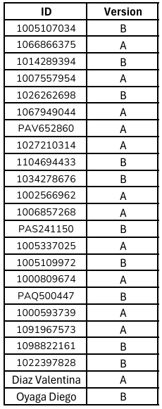

# Taller 4 - Models
---
## Fecha de entrega: 3 Septiembre 2025
---

En **oTree**, los `models` son las clases y variables que definen la **lógica y los datos del experimento**.  
Todo lo que quieras **guardar en la base de datos** debe declararse como un **campo de modelo**.

---

## Tipos de modelos en oTree

En cada app de oTree, por defecto existen 3 modelos principales:

### 1. Subsession

- Representa una **ronda** del experimento.  
- Si tienes 5 rondas, habrá 5 instancias de `Subsession`.  
- Se usa para configurar condiciones al inicio de cada ronda.

### 2. Group

- Representa un **grupo de jugadores**.  
- Si tu juego es individual, no necesitas modificarlo.  
- Si tu juego es en grupos (ej: dilema del prisionero, bienes públicos), aquí guardas variables **colectivas**.

### 3. Player

- Representa a **cada participante**.  
- Aquí defines las **respuestas individuales** (ej: decisiones, preguntas del cuestionario, puntajes).

---

## Ejemplo básico

```python
    from otree.api import *

    class C(BaseConstants):
        NAME_IN_URL = 'mi_juego'
        PLAYERS_PER_GROUP = 2
        NUM_ROUNDS = 3

    class Subsession(BaseSubsession):
        pass

    class Group(BaseGroup):
        total = models.IntegerField()  # dato del grupo

    class Player(BasePlayer):
        decision = models.IntegerField()  # dato del jugador
        age = models.IntegerField(label="¿Cuál es tu edad?")
```
En este ejemplo:

- `Group.total` guarda un número compartido por los jugadores del grupo.  
- `Player.decision` y `Player.age` son respuestas individuales que se almacenan en la base de datos.  

---

### Campos (`models.Field`)

Los más usados son:

- `models.IntegerField()` → números enteros.  
- `models.FloatField()` → números decimales.  
- `models.StringField()` → texto.  
- `models.BooleanField()` → verdadero/falso.  
- `models.CurrencyField()` → dinero (usa la unidad experimental de oTree).  

Ejemplo con opciones:

```python
    choice = models.IntegerField(
        choices=[1, 2, 3],
        label="Elige un número"
    )
```

## Resumen

- Los `models` son las variables que se guardan en la base de datos.

- Se dividen en:

    - `Subsession` (ronda)

    - `Group` (grupo)

    - `Player` (participante)

- Usas `models.*Field()` para definir los datos que quieres almacenar.

---

### Recursos útiles

- [Documentación oficial de oTree - Models](https://otree.readthedocs.io/en/latest/models.html)

- [Ejemplos oficiales de oTree](https://www.otreehub.com/)

- [Guía rápida de oTree en español (GitHub)](https://github.com/otree-org/otree)

---

## 📚 Actividad practica 


❗**Nota:** `Recordar usar el método de entrega de actividades y parciales indicado en la sección de "Entrega de actividades y parciales" del curso.` *[Click para visitar "Entrega de actividades y parciales" en la introducción del curso.](../../README.md)*

1. [QUIZ Experimental Methods](https://forms.gle/sXjYpAZAj86CfNSu5)

2. 

    - Versión A:

        a.

    ---

    - Versión B:

        a.


En la siguiente lista se realiza la asignación de la versión a entregar. La asignación se realizó **al azar** y a **cada ID** de le asignó **una versión**: 



Dependiendo de la versión asignada, deberás cumplir con las tareas correspondientes a cada una y para una mejor verificación de lo realizado tomar una ScreenShot al finalizar cada inciso, **adjuntar las imágenes con el proyecto creado en un zip al correo designado**.

Enlaces de interés:

- [Apoyo Taller 4]()

- [Rúbrica de calificación]()