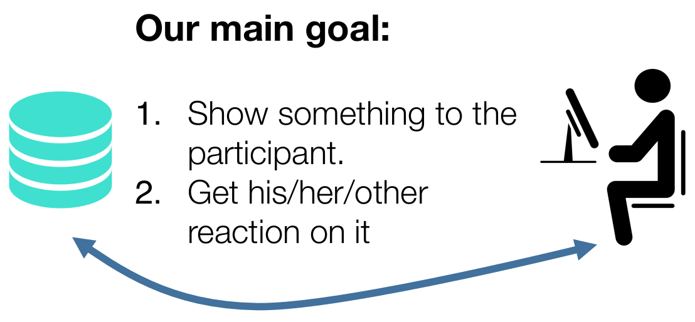
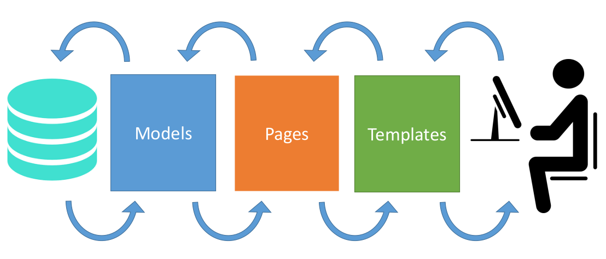
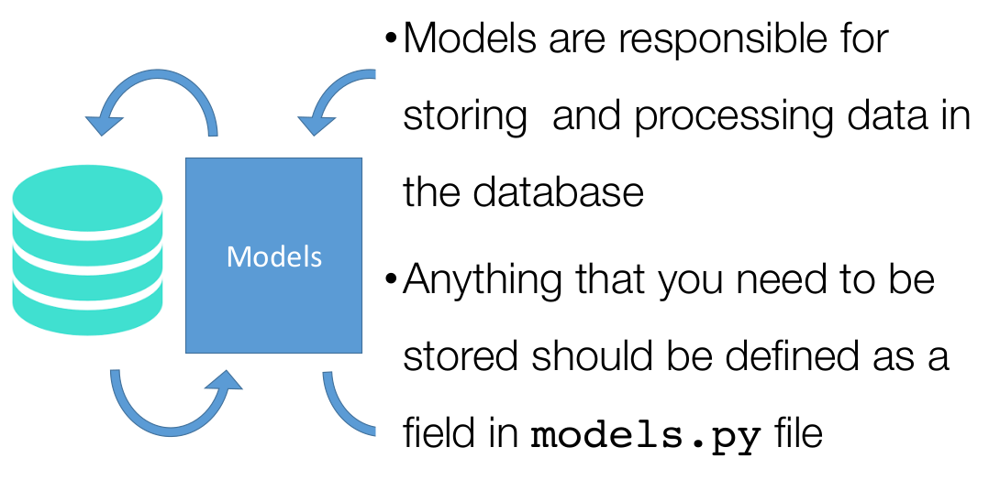
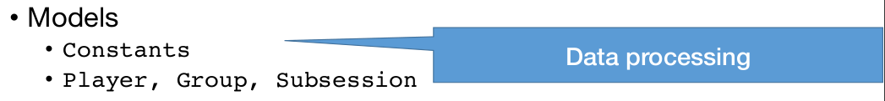
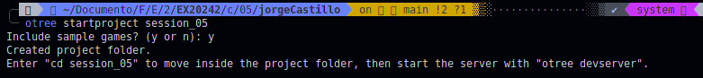
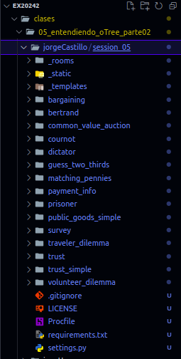
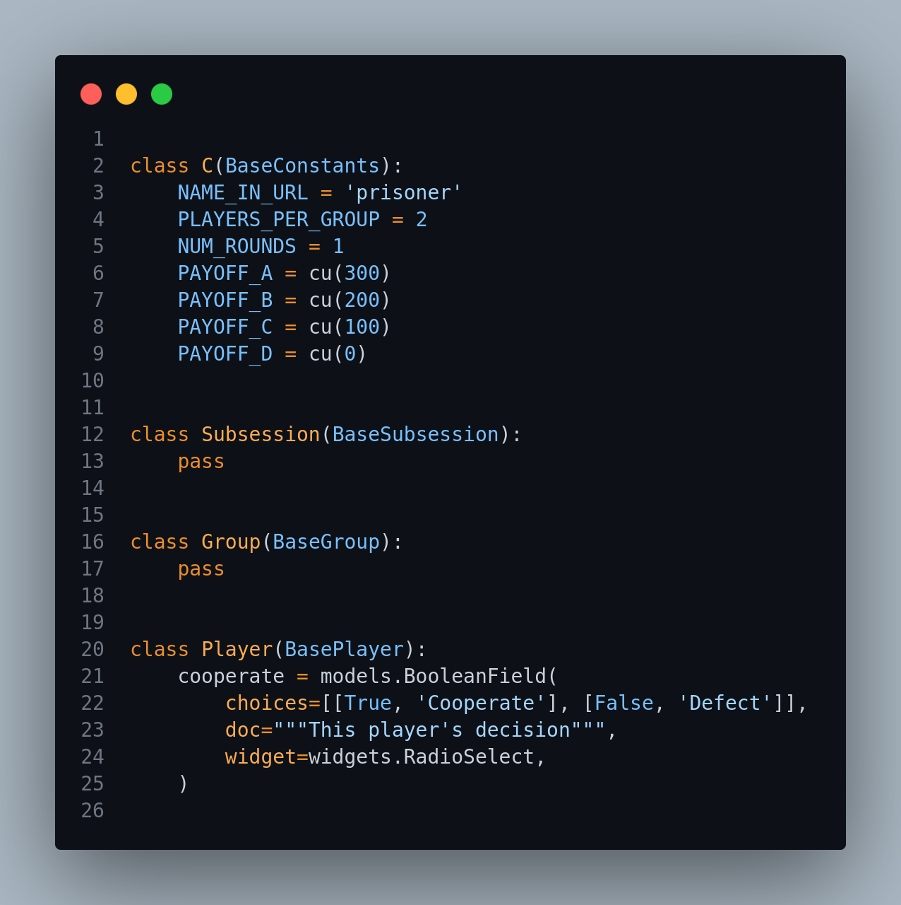

# Entendiendo oTree Parte 2: Models - Prisoner

Después de haber visto en nuestra [sesión anterior](../04_entendiendo_oTree_parte01/README.md) la jerarquía de trabajo de oTree así como desarrollado el juego de 'Adivinar 2/3 del promedio' ahora vamos a adentrarnos un poco más y poder personalizar de mejor manera las actividades dentro de un experimento. Para ello, en esta sesión trabajaremos con los Modelos o `Models`.

Pero, antes de hablar de ello, es necesario recapitular en lo siguiente:

<sup><a href="#bib_01">1</a></sup>

Nuestro objetivo con los experimentos, desde una perspectiva computacional, es eso: Mostrarle algo al participante y obtener su reacción/interacción.

Esta obtención de interacción se puede hacer de muchas maneras y no podemos limitarnos a que sean solamente cosas que hace el participante como ingresar un nombre, un número, presionar un botón; también son datos que el participante no ingresa pero con lo cual si participa activamente: cuánto tiempo le demoró en escoger una respuesta, escogió varias respuestas, miró más a una parte de la pantalla, pasó más el mouse por un sector que por otro de la pantalla.

Todos estos datos _(lista de opciones, tiempos, verdadero/falso, etc)_ nos son muy útiles para validar o no las teorías que tengamos y poder generar mejores conclusiones a través de su respectivo análisis.

Ahora bien **¿ Cómo lo podemos hacer con oTree ?** Usando modelos. Los modelos son representaciones de nuestros datos en la base de datos, y estos modelos son los que lo almacenan, por eso son tan importantes. En la actualidad y por defecto oTree tiene los modelos de Participant, Player, Session, Subsession y Group. Se pueden crear más, pero para la gran mayoría de actividades y situaciones estos son de ayuda.

Siendo así, la interacción del participante con oTree está representada por la siguiente imagen:

<sup><a href="#bib_02">2</a></sup>

En donde nos centraremos en esta sesión en las dos gráficas de la izquierda _(la base de datos y la parte de models del código)_.

> **Nota:** Las siguientes imágenes son basadas en la bibliografía <a href="#bib_01">1</a>, que está elaborado con oTree 3.4 o anterior; por lo cual las partes de Models, Pages y Templates estaban separadas. Actualmente se usa oTree versión 5.0 o mayor, en la cual todo se realiza en el archivo `__init__.py`.
Todo lo que se mencione relaciona a Models.py se debe realizar a que actualmente se realiza en `__init__.py`.

Siendo así, entonces Models:

<sup><a href="#bib_02">2</a></sup>

<sup><a href="#bib_02">2</a></sup>

Ahora que ya sabemos cuál es la idea de los Modelos, pasaremos a qué tipo de datos pueden almacenar. Estos datos se conocen como campos o Fields.

La idea más fácil de visualizarlos en como si fuesen una tabla, en donde las columnas son cada uno de estos campos y cada fila es un participante de la actividad _(jugador)_.<sup><a href="#bib_01">1</a></sup>

```bash
nombre  edad    es_estudiante
Juan    30      False
Ana     22      True
Carlos  35      False
...
```

## Campos

### Tipos de Campos

Los tipos de campos son:

- **BooleanField** &rarr; Para datos que van a tomar valores de Verdadero o Falso. No permite ningún otro valor.

- **CurrencyField** &rarr; Usado para manejar dinero, teniendo en cuenta el tipo de moneda configurado en `settings.py`.

- **IntegerField** &rarr; Para almacenar cualquier número entero.

- **FloatField** &rarr; Para almacenar números reales, o sea, que tienen una parte decimal.

- **StringField** &rarr; Para almacenar cadenas de texto o texto en general.

- **LongStringField** &rarr; Usado para cuando se quieren almacenar grandes cantidades de texto, como campos en donde se piden reseñas, comentarios u observaciones largas, etc.

### Personalización de los campos

Los campos se pueden personalizar al momento de crearlo:

```python
    campo = tipoCampo(
        personalizacion1 = "asd",
        personalizacion2 = 1234,
        ...
    )
```

Estos personalizables son:

- **initial** &rarr; Permite establecer un valor inicial o por defecto para ese campo. Si el campo es de tipo texto e debe colocar el valor entre comillas. Si es un booleano debe ser Verdadero o Falso.

- **max** &rarr; Permite establecer el valor máximo que se puede colocar. Válido solo para campos de tipo numérico (Integer, Float, Currency).

- **min** &rarr; Permite establecer el valor mínimo que se puede colocar. Válido solo para campos de tipo numérico (Integer, Float, Currency).

- **choices** &rarr; Permite establecer una lista de opciones que puede tener el campo. Se deben colocar como una lista `[opcion1, "opcion2", opcion3]` teniendo en cuenta el tipo de campo.

- **label** &rarr; Permite establecer la etiqueta o texto que acompaña al campo, como guía para que el participante conozca qué debe ingresar/realizar.

## Actividad Práctica: Dilema del prisionero

Para la actividad práctica vamos a realizar cambios en Models de un ejemplo que ya existe. Para esto es necesario primero tener actualizado nuestra carpeta de trabajo.

Abrimos la terminal para nuestra carpeta _(click contrario -> abrir terminal integrado)_ y en la terminal escribimos:

```bash
otree startproject session_05
```

Y cuando nos pregunte si incluir los juegos de ejemplo, ingresar `y` para que los cree.



Luego, ingresamos a la carpeta del proyecto

```bash
cd session_05
```

Y miramos en nuestro lateral izquierdo que se cargan todas las aplicaciones.



Lo primero que vamos a hacer es modificar el archivo `settings.py` para añadir el de `prisoner`.

```python
SESSION_CONFIGS = [
    dict(
        name = 'prisoner',
        display_name = "Dilema del Prisionero",
        app_sequence = ['prisoner'],
        num_demo_participants = 4,
    ),
]
```

Y eliminar el archivo `db.sqlite3`. Luego, procedemos a darle correr para probarlo:

```bash
otree devserver
```

> **Nota:** Revise bien la interacción de hay en ese momento. Haǵalo abriendo en una pestaña el jugador 1 y en otra el jugador 2.

Después de probado, ahora la actividad consiste en modificar o agregar en la sección de Models de `__init__.py` los campos de Constantes y de Jugador.



No use el mismo tipo de campo que ya se está usando en cada modelo _(o sea si va a modificar o agregar algo en Constantes que sea de un tipo diferente a los que ya están)_. Recuerde el juego que se está trabajando.

> **Anotación:** ¿ Y si agrego una(s) variable(s) en Grupo ? ¿ Cuál(es) sería ? _punto extra_

### NOTA

Para la nota del taller de la sesión deben interactuar con mínimo 4 jugadores (2 grupos), descargar el archivo con los datos en formato `.csv` y enviar al profesor Ferley `heiner.rincon@urosario.edu.co` con el asunto `Taller sesión 5`, y con copiar a `hopkeinst@gmail.com`. Se va a tener en cuenta la rúbrica señalada en el documento [Rubrica_session05](Rubrica_session05.pdf).

Cualquier error que presenten, pueden guiarse de los archivos en la carpeta [jorgeCastillo/session_05](jorgeCastillo/session_05/).

## Bibliografía

<ol>
    <li id="bib_01"> oTree, “Models” oTree Documentation. [Online]. Available: <a href="https://otree.readthedocs.io/en/latest/models.html">https://otree.readthedocs.io/en/latest/models.html</a>. [Accessed: 07-Sep-2024].
    <li id="bib_02"> Philipp Chapkovski, “Zurich workshop on online experiments” Repositorio de GitHub. [Online]. Available: <a href="https://github.com/chapkovski/zurich-workshop">https://github.com/chapkovski/zurich-workshop</a>. [Accessed: 08-Sep-2024].
    <li id="bib_03">Wikipedia, “Dilema del prisionero” Wikipedia. [Online]. Available:  <a href="https://es.wikipedia.org/wiki/Dilema_del_prisionero">https://es.wikipedia.org/wiki/Dilema_del_prisionero</a>. [Accessed: 08-Sep-2024].
</ol>
