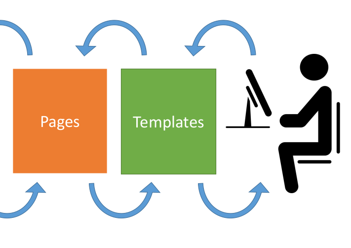
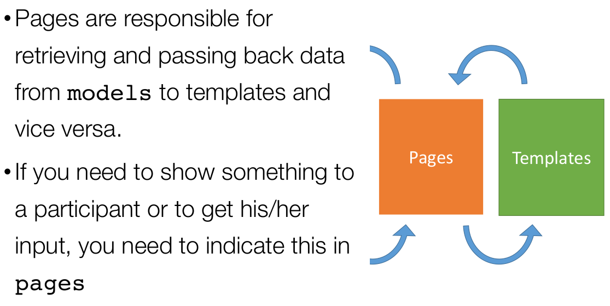
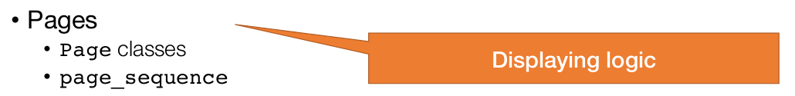

# Entendiendo oTree Parte 3: Pages & Templetes - Matching Pennis

Después de haber visto en nuestra [sesión anterior](../05_entendiendo_oTree_parte02/README.md) sobre el uso de Models para almacenar los datos de nuestros experimentos, ahora veremos cómo el participante interactúa con cada pantalla que se le muestra y en dónde se realiza la lógica del experimento.

## Pages

Cada una de las páginas que van a visualizar los participantes tienen que ser definidas en '# Pages' por la clase `Page`.

En cuanto a los tipos hay 2: Las páginas para que el participante interactúe directamente y las páginas de espera. En ambas se pueden mostrar y recolectar datos.

<sup><a href="#bib_03">3</a></sup>

En sí la idea de 'Pages' es que son sirvan de puente entre los modelos _(base de datos)_ y los templates _(páginas web en la que interactúan los participantes)_. Si necesitamos recolectar algún dato en específico o mostrarlo, esto se especifíca en su Page respectivo.

<sup><a href="#bib_03">3</a></sup>

Y también se define el orden de mostrar las páginas web y la lógica entre página y página _(calcular un valor, aleatorizar un orden, etc)_.

<sup><a href="#bib_03">3</a></sup>

Como ya se había mencionado antes, la idea es que por cada página que se le muestre al participante exista una clase con Page o WaitPage según sea el caso, y aquí unas personalizaciones al respecto:

### is_diplayed() <sup><a href="#bib_01">1</a></sup>

Método usado para saber si se muestra o no una página al participante. Se coloca dentro de la página y un condicional para obtener este resultado. No es necesario que todas las páginas lo lleven, cuando no lo llevan siempre se muestra esa página.

```python
class PaginaPares(Page):
    @staticmethod
    def is_displayed():
        return player.round_number % 2 == 0
## Muestra la página 'PaginaPares' si la ronda en que 
## está actualmente el jugador es par -> Operación Módulo

class Instrucciones(Page):
    pass 
## Muestra siempre la página de instrucciones sin importar
## el jugador, la ronda u otra característica
```

### vars_for_template() <sup><a href="#bib_01">1</a></sup>

Método usado para pasar variables _(datos)_ al template, para que el usuario los visualice.

Cuando se pasan, se hace en un formato de diccionario de python. Si se quiere acceder a datos almacenados en 'Models' se puede hacer de manera directa en el template solamente llamando a la clase del modelo _(`player`, `group`m `subsession`, `participant`, `session`, `C`)_ y a la variable directamente, como por ejemplo: `{{ player.edad }}` o `{{ C.NUM_ROUNDS }}` o `{{ group.maxima_apuesta }}`.

Aquí un ejemplo de su uso:

```python
def historico_promedio_2_3(group: Group):
    return [g.dos_tercios_promedio for g in group.in_previous_rounds()]
## En la anterior función obtengo de un grupo los valores de la variable
## dos_tercios_promedio de anteriores rondas y lo devuelvo en una lista
## ejemplo: [10, 65, 31]
## donde 10 fue el 2/3 del promedio de la ronda 1
## 65 fue el 2/3 del promedio de la ronda 2
## y 31 fue el 2/3 del promedio de la ronda 3

class Estimacion(Page):
    @staticmethod
    def vars_for_template(player: Player):
        group = player.group
        return dict(historico_2_3=historico_promedio_2_3(group))
## Para cuando se vaya a mostrar la página 'Estimacion' entonces
## se obtiene el grupo en el que está el jugador y mediante la 
## función 'historico_promedio_2_3' se obtiene los promedios
## de los 2/3 del promedio de rondas anteriores (el histórico)
## para pasarlo al template y mostrar al participante

class Resultados(Page):
    @staticmethod
    def vars_for_template(Player player):
        calculado = player.opcion_1 + player.opcion_2
        return dict(
            "calculado": calculado
        )
## Para cuando se muestre la página Resultados envía para mostrar
## un dato calculado a partir de 2 variables de Jugador, con el
## nombre 'calculado'. En el template se llama usando llaves:
## {{ calculado }} para mostrarlo
```

Y en el template se puede obtener los datos pasados de la siguiente manera: 

```html
<p>
    Los valores promedio de los 2/3 de las rondas anteriores son: {{ historico_2_3 }}
</p>
```

### before_next_page() <sup><a href="#bib_01">1</a></sup>

Método usado para realizar un proceso antes de que pase a la siguiente página. Es muy útil, para tener valores definidos antes de mostrarle al usuario la siguiente página porque a veces se les muestra y se hace el proceso _(ejemplo: aleatorizar un orden)_ dentro de la misma página y ellos recargan la página y todo cambia _(se vuelve a aleatorizar)_.

Un ejemplo de su uso sería:

```python
# Models
class player(Player):
    random_apuesta = models.FloatField()
    valor_decision = models.IntegerField(
        min = 0,
        max = 10,
        label = "Ingrese un valor entre 0 y 10"
    )
## Creo la variable donde voy a almacenar lo que voy a calcular

...

# Pages
class Decision(Page):
    form_model = 'player'
    form_fields = ['valor_decision']
    @staticmethod
    def before_next_page(player):
        player.random_apuesta = random.random() * player.valor_decision
## Tengo una página donde muestro un formulario para que el jugador ingrese un 
## valor, el cual voy a multiplicar por un valor aleatorio y almacenar ese 
## resultado en una variable del jugador
```

### Wait Pages <sup><a href="#bib_01">1</a></sup>

Son las páginas de espera, estas solamente deben definirse y colocarse en la secuencia. Pueden también mostrar mensajes o hacer procesos cuando se llega a esta página.

```python
class EsperaJ1(WaitPage):
    pass
## Al llegar a esta página de espera no se hace nada
...

class EsperaJ2(WaitPage):
    after_all_players_arrive = set_payoffs
## Al lelgar a esta página de espera se calculan los pagos
...

page_sequence = [Instrucciones, Enviar, EsperaJ1, Devolver, EsperaJ2, Results]
## Y aquí se agregan las páginas de espera al orden de mostrar las páginas
```

### page_sequence <sup><a href="#bib_01">1</a></sup>

Está al final del archivo `__init__.py` y define el orden de cómo se mostrarán las páginas. Es muy importante, porque si no están aquí las páginas no se mostrarán.

```python
page_sequence = [Instrucciones, Enviar, EsperaJ1, Devolver, EsperaJ2, Results]
```

## Templates <sup><a href="#bib_02">2</a></sup>

Los templates, como su nombre lo dicen son plantillas. Son los archivos `.html` que en realidad son una plantilla usando el lenguaje de marcado para organizar lo que queremos mostrar o la interacción que queremos tener con el participante.

Dentro de este encontramos:

- Variables
- Condicionales (if)
- Ciclos repetitivos (for)
- Campos del formulario (formfields)

### Variables

Podemos mostrar las variables que vamos almacenando o que tenemos previamente registradas por la lógica de la aplicación/sesión.

Para acceder a ellas se hace por medio de llaves, como por ejemplo:

```html
El factor multiplicador es de {{ C.MULTIPLICADOR }}.<br>
<br>
Recuerde que el dato que ingresaste es {{ player.dato }}<br>
```

Se puede acceder de manera directa a las variables de `player`, `group`, `subsession`, `participant`, `session`, `C` sin necesidad de pasarlo por medio de _vars_for_template()_ como se vió en el anterior item de 'Pages'.

### Condicionales (if)

Puedes colocarle lógica para mostrar o no algo en la pantalla, usando el condicional 'if'. Un ejemplo de esto es:

```html
{{ if p.edad > 18 }}
El jugador es <b>mayor</b> de edad.
{{ else }}
El jugador es <b>menor</b> de edad.
{{ endif }}
```

Se pueden usar comparaciones como igual `==`, diferente `!=`, mayor que `>`, menor que `<`, mayor o igual que `>=`, menor o igual que `<=`.

### Ciclos repetitivos (for)

Cuando tenemos una lista _(números, objetos, texto, etc)_ podemos **iterar** sobre esta, o sea, recorrerla elemento a elemento. 

La manera de hacerlo es:

```html
Las personas que están en tu grupo son:
{{ for person in group.get_players() }}
    - {{ person.name }}<br>
{{ endfor }}
```

> **Nota:** En algunas versiones antiguas de oTree 3, se usan los condicionales y los ciclos for con '' pero en la versión 5 de oTree se sugiere usar '{{ }}'.

## Actividad Práctica: Matching Pennis <sup><a href="#bib_04">4</a></sup>

También es un juego de suma cero, en el cual dos(2) jugadores tiran una moneda al aire y luego revelan su resultado. Si ambos coinciden uno de los jugadores _(jugador A)_ se llevara el premio, si no coinciden se lo llevará el otro jugador _(jugador B)_.

### NOTA

Para la nota del taller de la sesión deben interactuar con mínimo 6 jugadores (3 grupos) e interactuar con ellos, descargar el archivo con los datos en formato `.csv` y enviar al profesor Ferley `heiner.rincon@urosario.edu.co` con el asunto `Taller sesión 6`, y con copia a `hopkeinst@gmail.com`.

Cualquier error que presenten, pueden guiarse de los archivos en la carpeta [jorgeCastillo/session_06](jorgeCastillo/session_06/).

## Bibliografía

<ol>
    <li id="bib_01"> oTree, “Pages” oTree Documentation. [Online]. Available: <a href="https://otree.readthedocs.io/en/latest/pages.html">https://otree.readthedocs.io/en/latest/pages.html</a>. [Accessed: 15-Sep-2024].
    <li id="bib_02"> oTree, "Templates" oTree Documentation. [Online]. Available: <a href="https://otree.readthedocs.io/en/latest/templates.html">https://otree.readthedocs.io/en/latest/templates.html</a>. [Accessed: 15-Sep-2024].
    <li id="bib_03"> Philipp Chapkovski, “Zurich workshop on online experiments” Repositorio de GitHub. [Online]. Available: <a href="https://github.com/chapkovski/zurich-workshop">https://github.com/chapkovski/zurich-workshop</a>. [Accessed: 15-Sep-2024].
    <li id="bib_04">Wikipedia, “Matching Pennies” Wikipedia. [Online]. Available:  <a href="https://en.wikipedia.org/wiki/Matching_pennies">https://en.wikipedia.org/wiki/Matching_pennies</a>. [Accessed: 15-Sep-2024].
</ol>
