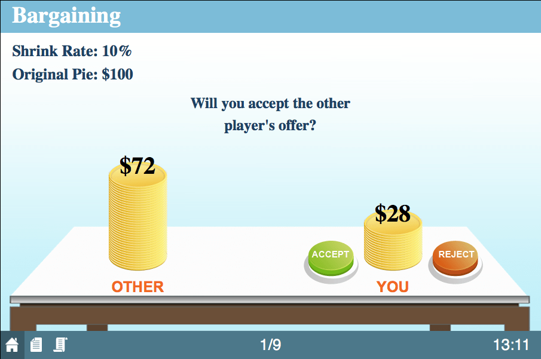
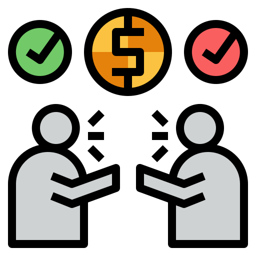
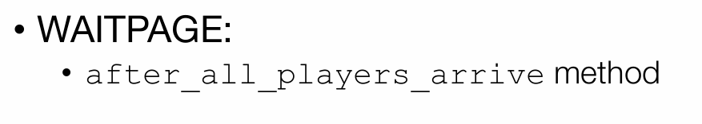
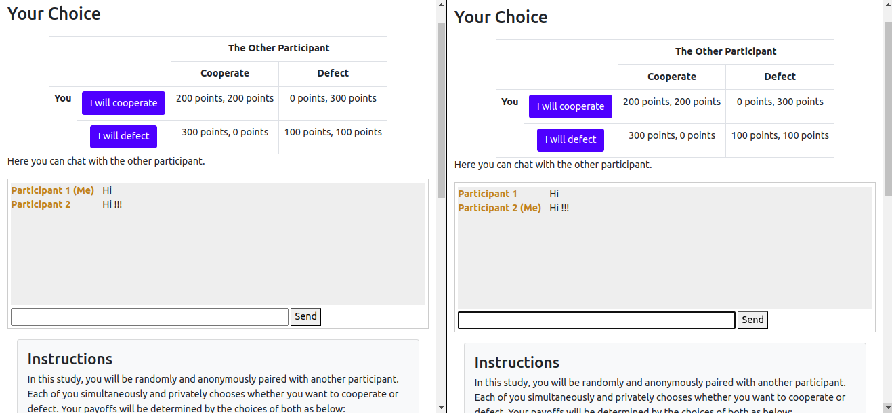

# Entendiendo oTree Parte 4: Multiplayer Games - Bargaining

Después de haber visto en nuestra [sesión anterior](../06_entendiendo_oTree_parte03/README.md) sobre el uso de *Pages y Templates* para la recolección y muestra de los datos de nuestros experimentos, ahora veremos cómo el participante interactúa con las paginas de espera y el uso del chat.

## Bargaining

Este juego de negociación se centra en cómo los participantes interactúan para llegar a un acuerdo sobre un recurso limitado. Cada jugador tiene que decidir cuánto del recurso ofrecer y cuánto retener. A lo largo del juego, los jugadores pueden hacer ofertas y contraofertas, lo que simula dinámicas reales de negociación. El objetivo es maximizar la utilidad personal mientras se busca un acuerdo, lo que a menudo implica equilibrar la cooperación y la competencia.

<sup><a href="#bib_01">1</a></sup>

Es un juego para 2 personas que son emparejadas de manera aleatoria y son enumerados: *jugador 1 y jugador 2.* 

<sup><a href="#bib_02">2</a></sup>

## Wait pages

Las páginas de espera se implementan en situaciones donde un jugador debe esperar a que otros tomen decisiones o realicen acciones antes de avanzar. Esto es especialmente relevante en juegos donde las acciones de un jugador afectan a los demás.

<sup><a href="#bib_03">3</a></sup>

En este ejemplo del juego de bargaining, la página de espera es crucial porque permite que Jugador **B** evalúe la propuesta de Jugador **A** antes de tomar una decisión. Esto no solo ayuda a garantizar que todos los jugadores tengan la información necesaria, sino que también resalta la naturaleza estratégica del juego, donde las decisiones de cada jugador están interrelacionadas.

 Si una subsesión implica varios grupos jugando al mismo tiempo y un investigador desea una página de espera que asegure que todos los jugadores de todos los grupos estén esperando, puede habilitar esta funcionalidad estableciendo el atributo wait_for_all_groups = True. Esto garantiza la sincronización en toda la subsesión, permitiendo una progresión coordinada del juego.

### after_all_players_arrive

La función **after_all_players_arrive** en oTree permite ejecutar ciertos cálculos una vez que todos los jugadores han llegado a una página de espera *(WaitPage)*. Esto es especialmente útil para realizar tareas como establecer las ganancias de los jugadores o determinar un ganador antes de que puedan avanzar al siguiente paso del juego.

Primero, es necesario definir una función a nivel de grupo que realice los cálculos deseados. Esta función podría, por ejemplo, calcular los pagos basados en las decisiones de cada jugador o seleccionar un ganador si el juego es competitivo:

```python
class Group(BaseGroup):
    def calculate_payoffs(self):
        # Aquí se realizan los cálculos de pagos o se determina un ganador
        for p in self.get_players():
            p.payoff = ...  # Cálculo del pago para cada jugador
```
Una vez que todos los jugadores han llegado a la página de espera, oTree llama a **after_all_players_arrive** para ejecutar la función de grupo que contiene los cálculos. Esto asegura que todos los jugadores tengan sus resultados calculados de manera sincronizada:

```python
class MyWaitPage(WaitPage):
    after_all_players_arrive = 'calculate_payoffs'
```
### is_displayed()

La función is_displayed() funciona tal cual como lo vimos en la [sesión anterior](../06_entendiendo_oTree_parte03/README.md#is_diplayed-1).

### group_by_arrival_time

La función **group_by_arrival_time_method()** en oTree se utiliza para agrupar jugadores dinámicamente en función del momento en que llegan a una página de espera *(WaitPage)*. Esto es útil en experimentos donde quieres agrupar a los jugadores en cuanto haya suficientes participantes en espera, sin tener que esperar a que todos los jugadores de la subsesión lleguen a esa página.

```python
# Nota: esta función se define a nivel de módulo, no dentro de la clase WaitPage.
def group_by_arrival_time_method(subsession, waiting_players):
    print('en group_by_arrival_time_method')
    
    # Filtra a los jugadores por categoría
    m_players = [p for p in waiting_players if p.participant.category == 'M']
    f_players = [p for p in waiting_players if p.participant.category == 'F']

    # Si hay al menos 2 jugadores en cada categoría, crea un grupo
    if len(m_players) >= 2 and len(f_players) >= 2:
        print('a punto de crear un grupo')
        return [m_players[0], m_players[1], f_players[0], f_players[1]]
    
    # Si no hay suficientes jugadores para formar un grupo, imprime el mensaje
    print('no hay suficientes jugadores para crear un grupo aún')
```

### Timeouts on wait pages
Los timeouts en una *"wait page"* permiten definir un límite de tiempo para la espera, de manera que si un jugador tarda demasiado en llegar a la página, o no interactúa, el juego puede seguir sin él. Esto es útil para evitar que todos los jugadores se queden esperando indefinidamente si alguien se desconecta o tiene problemas de conexión.

```python
def waiting_too_long(player):
    # Obtiene el objeto "participant" asociado al jugador.
    participant = player.participant

    # Importa el módulo "time" para trabajar con marcas de tiempo.
    import time

    # Supone que "wait_page_arrival" está definido en PARTICIPANT_FIELDS.
    # Calcula si el jugador ha estado esperando en la página de espera
    # por más de 5 minutos (5*60 segundos).
    # Si el tiempo actual menos el tiempo de llegada a la página de espera 
    # es mayor a 5 minutos, devuelve True (indicando que ha esperado demasiado).
    return time.time() - participant.wait_page_arrival > 5*60
```

```python
def group_by_arrival_time_method(subsession, waiting_players):
    # Si hay al menos 3 jugadores en la lista de espera, agrúpalos en un grupo de 3
    if len(waiting_players) >= 3:
        return waiting_players[:3]  # Retorna los primeros 3 jugadores en la lista de espera

    # Si no hay suficientes jugadores para formar un grupo completo,
    # revisa si alguno ha esperado demasiado tiempo
    for player in waiting_players:
        if waiting_too_long(player):
            # Si un jugador ha esperado demasiado, crea un grupo solo para él
            return [player]
```

### Preventing players from getting stuck on wait pages

En oTree, al trabajar con páginas de espera *(wait pages)* en juegos multijugador, es posible que algunos jugadores se queden **"atascados"** si otros jugadores abandonan o tienen problemas de conexión. Esto puede hacer que la espera se extienda indefinidamente. Para evitar que los jugadores queden atrapados en una página de espera, oTree ofrece estrategias que permiten manejar estos casos.

#### Use group_by_arrival_time

La función **group_by_arrival_time** permite agrupar solo a los jugadores que están activos al mismo tiempo. Esto funciona bien después de una tarea inicial individual **(o “lock-in task”)**. La idea es que, al completar esta primera tarea de esfuerzo, es menos probable que los participantes abandonen durante el juego multijugador.

#### Use page timeouts

Agregar **timeout_seconds** en cada página permite que, si un jugador es lento o inactivo, su página avance automáticamente. Además, en la interfaz de administración de oTree, se puede forzar el avance de los jugadores más lentos usando el botón *“Advance slowest participants”*.

#### Check timeout_happened

Puedes informar a los jugadores que deben completar una página antes de que termine el tiempo, o serán contados como abandonos. Una página podría simplemente pedir al jugador que haga *clic* en *“Siguiente”* para confirmar que sigue jugando. Luego, puedes verificar **timeout_happened**; si es True, puedes marcar al jugador como abandonado y omitir el resto de las páginas para esa ronda.

#### Replacing dropped out player with a bot

Para que el juego continúe incluso si alguien abandona, puedes hacer que oTree los reemplace con un bot que siga jugando automáticamente. Para esto:

- Define un campo llamado is_dropout en participant y establece su valor inicial en False.
- Usa **get_timeout_seconds** y **before_next_page** en cada página para verificar el estado y configurar el avance automático si el jugador se desconecta.

```python
class Page1(Page):
    # Define el modelo de formulario para esta página como 'player'
    form_model = 'player'
    # Define los campos del formulario que se mostrarán en esta página
    form_fields = ['contribution']

    @staticmethod
    def get_timeout_seconds(player):
        # Obtiene el objeto "participant" asociado al jugador
        participant = player.participant

        # Si el participante está marcado como "abandonado" (is_dropout es True),
        # establece un tiempo de espera instantáneo (1 segundo)
        if participant.is_dropout:
            return 1  # tiempo de espera instantáneo de 1 segundo
        else:
            # Si el participante no está marcado como abandonado, el tiempo de espera es de 5 minutos (5*60 segundos)
            return 5*60

    @staticmethod
    def before_next_page(player, timeout_happened):
        # Obtiene el objeto "participant" asociado al jugador
        participant = player.participant

        # Si el tiempo de espera se agotó y el jugador no respondió,
        # establece el valor de 'contribution' en 100 unidades de la moneda y
        # marca al participante como "abandonado" (is_dropout = True)
        if timeout_happened:
            player.contribution = cu(100)
            participant.is_dropout = True
```

### Customizing the wait page’s appearance

Para finalizar con la teoría, puedes personalizar la apariencia de una página de espera ajustando los atributos **title_text** y **body_text**. Por ejemplo, al crear una clase de página de espera, puedes establecer un texto personalizado para el título y el cuerpo. Esto permite que los participantes vean mensajes específicos mientras esperan, mejorando así la experiencia del usuario.

```python
class MyWaitPage(WaitPage):
    # Este es el título personalizado que aparecerá en la página de espera.
    title_text = "Custom title text"
    
    # Este es el cuerpo de texto que se mostrará debajo del título en la página de espera.
    body_text = "Custom body text"
```

## Chat

El chat es otra herramienta muy usada para cuando se trabajan grupos y que permite que los jugadores interactuen.

Para trabajo en grupos solo basta con agregar la etiqueta `{{ chat }}` en el _template_ HTML que se quiera usar. Por defecto oTree conectará y permitirá que solamente los jugadores de un grupo interactúen entre ellos.

```html
{{ block title }}Your Choice{{ endblock }}
{{ block content }}

    <!-- Aquí el resto del template>
    ...
    -->

    <p>Here you can chat with the other participant.</p>

    {{ chat }}

{{ endblock }}
```
<sup><a href="#bib_05">5</a></sup>

Obteniendo un resultado como este:



## Actividad Práctica: Bargaining
La negociación cooperativa o **"Cooperative bargaining"** es un proceso en el que dos personas deciden cómo compartir un excedente que pueden generar conjuntamente. Dado que este excedente puede dividirse de diversas maneras, los jugadores deben negociar cuál opción elegir. Este tipo de problemas de distribución se presentan en situaciones como la división de ganancias entre la dirección y los trabajadores, así como en la especificación de términos comerciales entre socios.

Ahora, la actividad consiste en:

1. Configurar "bargaining" en settings.py (2 jugadores por grupo).
2. Agregar una personalización a la página de espera.
3. Agregar por tiempo a la página de espera: si se demora más de 1 minuto el otro jugador, le coloque un valor de 0 puntos.
4. Agregar un chat para cada grupo en la parte en que se coloca la cantidad de puntos a aportar.

## NOTA

Para la nota del taller de la sesión deben interactuar con mínimo 2 jugadores (1 grupos) e interactuar con ellos, deben generar el archivo `.otreezip` enviarlo al profesor Ferley `heiner.rincon@urosario.edu.co` con el asunto `Taller sesión 7`, y con copia a Jorge `hopkeinst@gmail.com`.

Cualquier error que presenten, pueden consultar a Jorge por correo electrónico o chat.

## Bibliografía

<ol>
    <li id="bib_01"> MobLab, “Bargaining Game,” [Online]. Available: <a href="https://moblab.com/edu/games/bargaining">https://moblab.com/edu/games/bargaining</a>. [Accessed: 29-Oct-2024].
    <li id="bib_02"> “Bargaining Icon,” Flaticon. [Online]. Available: <a href="https://www.flaticon.com/free-icon/bargaining_5347789?related_id=5347789&origin=search">https://www.flaticon.com/free-icon/bargaining_5347789?related_id=5347789&origin=search</a>. [Accessed: 29-Oct-2024].
    <li id="bib_03"> Philipp Chapkovski, “Zurich workshop on online experiments” Repositorio de GitHub. [Online]. Available: <a href="https://github.com/chapkovski/zurich-workshop">https://github.com/chapkovski/zurich-workshop</a>. [Accessed: 15-Sep-2024].
    <li id="bib_04">Wikipedia, “Cooperative bargaining.” Wikipedia. [Online]. Available: <a href="https://en.wikipedia.org/wiki/Cooperative_bargaining">https://en.wikipedia.org/wiki/Cooperative_bargaining</a>. [Accessed: 29-Oct-2024].
    <li id="bib_05">oTree, "Chat" oTree Documentation. [Online]. Available: <a href="https://otree.readthedocs.io/en/latest/multiplayer/chat.html">https://otree.readthedocs.io/en/latest/multiplayer/chat.html</a>. [Accessed: 29-Oct-2024].
</ol>
