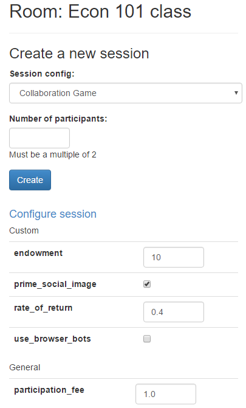

# Entendiendo oTree: Gift Exchange con Real Effort Task

Después de haber visto en nuestra [sesión anterior](../07_entendiendo_oTree_parte04/README.md) sobre el uso de *Multiplayer Games y chat* para la configuración de participantes de nuestros experimentos, ahora veremos cómo implementar y personalizar un juego de intercambio de regalos con una tarea de esfuerzo real usando oTree, cubriendo conceptos claves como "Apps & Rounds" y "Treatments & Timeouts"

## Introduction to the Real Effort Task Gift Exchange Game

El juego de intercambio de regalos es un experimento económico que modela una situación de reciprocidad en el trabajo, en la que un "empleador" ofrece un salario a un "empleado" a cambio de un nivel de esfuerzo. La "tarea de esfuerzo real" asignada permite que el nivel de trabajo del participante tenga un efecto directo en el resultado del juego.

### Game Objectives

El propósito es observar cómo la compensación y el nivel de esfuerzo afectan la reciprocidad entre los jugadores. Cada "empleado" elige su nivel de esfuerzo en respuesta al salario ofrecido, y los resultados ayudan a explorar incentivos y comportamientos en situaciones de trabajo.

## Apps & rounds

### Apps

En oTree, una *app* es una parte del experimento que organiza y gestiona el flujo de la experimentación, agrupando tareas y funciones en un solo bloque. Cada app puede tener su propia lógica y visualización, y pueden ser combinadas en diferentes configuraciones para crear experimentos más complejos. Los experimentos en oTree se dividen en rounds, que son ciclos repetitivos de la app, permitiendo que los participantes realicen acciones múltiples veces dentro del mismo juego o experiencia.

#### Combining apps

Para *combinar varias apps* en un solo experimento de oTree, debes incluirlas en el archivo settings.py en la lista SESSION_CONFIGS. De esta forma, cada app se ejecutará en secuencia durante las rondas del experimento.

```python
SESSION_CONFIGS = [
    dict(
        name='exp1',
        display_name="First experiment",
        num_demo_participants=2,
        app_sequence=['app1', 'app2', 'app3'], #Aquí se coloca el orden y las apps que deseas combinar
    ),
]
```

#### Passing data between apps

En oTree, puedes pasar datos entre diferentes *apps* utilizando variables en *participant o session*. Al almacenar datos en estas variables, puedes acceder a ellos en rondas posteriores de cualquier app. Por ejemplo, puedes guardar información como una recompensa o un puntaje y recuperarla más adelante para su uso en otra app. Esto se realiza mediante las funciones definidas en cada *app* y es útil para crear flujos de trabajo que requieren mantener el estado entre múltiples aplicaciones.

### Rounds

Las rounds representan las repeticiones de una misma fase del experimento. Dentro de una session, puedes tener múltiples *rounds*, y cada *round* puede contener múltiples apps que se ejecutan secuencialmente. Al usar rounds, puedes gestionar cómo se distribuyen las actividades entre las aplicaciones, permitiendo que los participantes pasen por varias fases del experimento de manera ordenada.

Para hacer que un juego se ejecute durante múltiples rondas en oTree, debes establecer **C.NUM_ROUNDS** en la configuración de tu aplicación. Por ejemplo, si el *app_sequence* de tu sesión es **['app1', 'app2']**, y **app1** tiene **NUM_ROUNDS = 3** y **app2** tiene **NUM_ROUNDS = 1**, entonces tu sesión tendrá 4 *subsesiones* en total. Cada ronda corresponderá a una nueva instancia del juego.

#### Round numbers

Puedes obtener el número de la ronda actual usando *player.round_number*. Este atributo está presente en los objetos de subsesión, grupo y jugador, y las rondas comienzan desde 1. Esto te permite hacer seguimientos de la ronda en la que se encuentra un jugador durante la ejecución de tu juego.

#### Passing data between rounds or apps

Cada ronda tiene objetos separados de *subsesión*, grupo y jugador. Por ejemplo, si estableces **player.my_field = True** en la *ronda 1*, en la *ronda 2*, al intentar acceder a **player.my_field**, su valor será None. Esto se debe a que los objetos de jugador de una ronda son distintos de los de otra ronda. Para acceder a datos de rondas o aplicaciones previas, puedes utilizar las técnicas descritas en la documentación de oTree.

#### in_rounds, in_previous_rounds, in_round, etc

En oTree, los objetos **Player, Group y Subsession** tienen métodos para acceder a datos de rondas previas:

- *in_previous_rounds()* devuelve jugadores de rondas anteriores.
- *in_all_rounds()* incluye jugadores de todas las rondas.
- *in_rounds(m, n)* devuelve jugadores de rondas específicas.
- *in_round(m)* accede a un jugador en una ronda específica.

Estos métodos te permiten consultar información de rondas anteriores sin necesidad de almacenarla explícitamente.

```python
# Accede al jugador de la ronda anterior usando el número de la ronda actual menos uno
prev_player = player.in_round(player.round_number - 1)

# Imprime el resultado de la ronda anterior (por ejemplo, el pago del jugador)
print(prev_player.payoff)
```

Los métodos como *in_previous_rounds()*, *in_all_rounds()*, *in_rounds()* e *in_round()* funcionan de la misma manera para los objetos de *subsession* y grupo. Sin embargo, no tiene sentido usarlos si se reorganizan los grupos entre rondas, ya que estos métodos presuponen que los grupos no cambian durante el juego. Para acceder a la información de rondas anteriores o entre diferentes grupos, se deben utilizar adecuadamente dependiendo de cómo se gestionen las sesiones y grupos en el experimento.

#### Participant fields

Para acceder a los datos de un participante de una aplicación anterior, debes almacenarlos en el objeto *Participant*, ya que estos datos persisten entre aplicaciones. Para hacer esto, ve a la configuración y define `PARTICIPANT_FIELDS`, que es una lista de los nombres de los campos que deseas almacenar en el participante. Los métodos como *in_all_rounds()* solo sirven para acceder a datos de rondas anteriores dentro de la misma aplicación.

Los campos personalizados de los participantes se almacenan internamente en un diccionario llamado *participant.vars*. Por ejemplo, *participant.mylist = [1, 2, 3]* es equivalente a *participant.vars['mylist'] = [1, 2, 3]*.

#### Session fields

Para las variables globales que son las mismas para todos los participantes en una sesión, debes agregarlas a `SESSION_FIELDS`. Al igual que con `PARTICIPANT_FIELDS`, estos campos se almacenan internamente en `session.vars`, lo que permite que los valores sean accesibles en todo el ciclo de la sesión para todos los participantes.

#### Variable number of rounds

Para manejar un número variable de rondas, puedes usar páginas en vivo (Live pages). Alternativamente, puedes establecer `NUM_ROUNDS` en un número alto y luego ocultar el botón `{{ next_button }}` o usar `app_after_this_page` para evitar que los participantes avancen. Sin embargo, ten en cuenta que tener muchas rondas (más de 100) podría generar problemas de rendimiento, por lo que es importante probar bien la aplicación.

## Treatments

Para asignar participantes a diferentes grupos de tratamiento, puedes usar `creating_session`. Este método se ejecuta cuando se crea la sesión y permite asignar valores aleatorios o específicos a los participantes o grupos. Por ejemplo, puedes asignar un valor booleano (`True` o `False`) a cada jugador para un tratamiento como `time_pressure`. También es posible hacer lo mismo a nivel de grupo utilizando el método `get_groups()`.

```python
def creating_session(subsession):
    import random
    # Iteramos sobre los jugadores en la subsesión
    for player in subsession.get_players():
        # Asignamos un valor aleatorio (True o False) a 'time_pressure' para cada jugador
        player.time_pressure = random.choice([True, False])
        # Imprimimos el valor asignado para verificar
        print('set time_pressure to', player.time_pressure)
```

### Treatment groups & multiple rounds

Para evitar que un jugador reciba tratamientos distintos en rondas diferentes de un juego, puedes asignar el tratamiento al objeto `participant` en lugar de al `player`. Esto es porque `creating_session` se ejecuta independientemente para cada ronda. Al usar `participant`, el tratamiento permanece constante a lo largo de todas las rondas.

```python
def creating_session(subsession):
    # Solo asignar tratamiento en la primera ronda
    if subsession.round_number == 1:
        for player in subsession.get_players():
            # Accedemos al participante del jugador
            participant = player.participant
            # Asignamos aleatoriamente un tratamiento de presión de tiempo
            participant.time_pressure = random.choice([True, False])
```

### Balanced treatment groups

Para lograr una asignación de tratamientos más balanceada entre jugadores, puedes utilizar itertools.cycle, que permite rotar de forma secuencial entre los valores. Esto asegura que todos los jugadores reciban los tratamientos de manera equitativa en lugar de aleatoria.

```python
def creating_session(subsession):
    import itertools
    pressures = itertools.cycle([True, False])  # 'itertools.cycle' crea un ciclo infinito que alterna entre True y False.
    for player in subsession.get_players():     # Itera sobre cada jugador en la subsesión actual.
        player.time_pressure = next(pressures)  # Asigna el siguiente valor del ciclo a 'time_pressure' del jugador.

```

### Choosing which treatment to play

En un experimento en vivo, asignar un tratamiento aleatorio a cada jugador puede ser ideal. Sin embargo, al probar tu juego, a veces resulta útil definir manualmente el tratamiento para mostrar variaciones a tus colegas. Para hacerlo, puedes crear dos configuraciones de sesión en oTree que sean idénticas, salvo por un parámetro específico (en oTree Studio, añade un "custom parameter").

```python
SESSION_CONFIGS = [
    dict(
        # Define una configuración de sesión para el juego, llamada 'my_game_primed'
        # Aquí el parámetro 'time_pressure' está configurado en True.
        name='my_game_primed',
        app_sequence=['my_game'],      # La secuencia de aplicaciones incluye solo 'my_game'
        num_demo_participants=1,       # Número de participantes para la demo
        time_pressure=True,            # Tratamiento con presión de tiempo activado
    ),
    dict(
        # Define otra configuración de sesión, llamada 'my_game_noprime'
        # En esta, 'time_pressure' está en False, sin presión de tiempo.
        name='my_game_noprime',
        app_sequence=['my_game'],      # La secuencia de aplicaciones incluye solo 'my_game'
        num_demo_participants=1,       # Número de participantes para la demo
        time_pressure=False,           # Tratamiento sin presión de tiempo
    ),
]

```

Para obtener el tratamiento actual de la sesión en tu código, puedes usar `session.config['time_pressure']`, lo que permite verificar el valor configurado para la variable `time_pressure` en la sesión actual. Esto es útil cuando necesitas adaptar la lógica del juego de acuerdo con el tratamiento seleccionado para cada sesión.

```python
session.config['time_pressure']
```

Para combinar la aleatorización con un tratamiento específico en la configuración de la sesión, primero verifica si `'time_pressure'` está en `session.config`. Si está presente, utiliza el valor especificado en la configuración; si no, elige el valor de forma aleatoria. Esto permite flexibilidad al aplicar condiciones de tratamiento predefinidas o aleatorias, facilitando pruebas con parámetros específicos y variabilidad según las necesidades de cada sesión.

### Configure sessions

Para hacer que los parámetros de una sesión en oTree sean configurables, puedes definir opciones en el archivo de configuración. Esto permite ajustar valores como el número de rondas, condiciones de tratamiento u otros parámetros directamente desde la interfaz de administración antes de iniciar la sesión. Esta configuración flexible facilita pruebas y permite adaptar las características del juego sin modificar el código cada vez que cambian las especificaciones del experimento.

<sup><a href="#bib_01">1</a></sup>

Para hacer que un parámetro como `num_apples` sea configurable en oTree, en lugar de definirlo en `C.NUM_APPLES`, puedes establecerlo en el archivo de configuración de la sesión (`SESSION_CONFIGS`). Esto te permitirá ajustar este valor directamente desde la interfaz administrativa de oTree sin necesidad de modificar el código. Puedes acceder a este parámetro dentro del juego usando `session.config['num_apples']` para personalizar el comportamiento según la configuración de la sesión seleccionada.

```python
dict(
    name='my_session_config',  # Nombre único de la configuración de la sesión.
    display_name='My Session Config',  # Nombre que se mostrará en la interfaz administrativa.
    num_demo_participants=2,  # Número de participantes en la sesión de demostración.
    app_sequence=['my_app_1', 'my_app_2'],  # Secuencia de las aplicaciones que se ejecutarán en la sesión.
    num_apples=10  # Parámetro configurable para el número de manzanas en el juego.
),
```

Cuando creas una sesión en la interfaz de administrador de oTree, se mostrará un cuadro de texto donde puedes modificar ciertos parámetros, como el número de participantes. Además, puedes agregar texto de ayuda con el parámetro `'doc'` para proporcionar instrucciones adicionales a los usuarios que creen sesiones. Esto ayuda a clarificar cómo configurar adecuadamente la sesión al establecer parámetros específicos.

```python
dict(
    name='my_session_config',  # Nombre de la configuración de la sesión
    display_name='My Session Config',  # Nombre visible de la configuración
    num_demo_participants=2,  # Número de participantes en la demostración
    app_sequence=['my_app_1', 'my_app_2'],  # Secuencia de aplicaciones que se ejecutarán
    num_apples=10,  # Parámetro numérico configurable
    doc="""  # Texto de ayuda que describe el propósito del parámetro
    Edit the 'num_apples' parameter to change the factor by which
    contributions to the group are multiplied.
    """
),
```

Para acceder a los parámetros configurables en tu código, puedes usar `session.config['num_apples']`.

Notas:

- Los parámetros configurables deben ser de tipo número, booleano o cadena.
- En la sección "Demo" de la administración, las sesiones no son configurables. Esta opción solo está disponible cuando se crean sesiones en las secciones "Sessions" o "Rooms".

## Timeouts

### Basics

#### timeout_seconds

Puedes usar el parámetro timeout_seconds, que especifica el tiempo máximo (en segundos) que un participante puede pasar en una página antes de que sea redirigido a la siguiente.

```python
# Se define una clase Page1 que hereda de Page
class Page1(Page):
    # Se establece un límite de tiempo de 60 segundos para esta página
    timeout_seconds = 60
    # Después de 60 segundos, la página se enviará automáticamente
```

Para establecer un límite de tiempo dinámico en una página en oTree, puedes usar `get_timeout_seconds`, lo que te permite determinar el tiempo de espera basado en condiciones específicas dentro del código. Si usas `timeout_seconds`, la página se enviará automáticamente cuando el tiempo se agote. En el servidor de producción, la página se enviará incluso si el participante cierra el navegador, pero en el servidor de desarrollo no sucederá lo mismo.

#### timeout_happened

Puedes comprobar si la página fue enviada por tiempo de espera:

```python
# Se define una clase Page1 que hereda de Page
class Page1(Page):
    # Se indica que el modelo del formulario es 'player'
    form_model = 'player'
    # Se especifican los campos del formulario
    form_fields = ['xyz']
    # Se establece un límite de tiempo de 60 segundos para esta página
    timeout_seconds = 60

    # Método que se ejecuta antes de ir a la siguiente página
    @staticmethod
    def before_next_page(player, timeout_happened):
        # Si se agotó el tiempo, se asigna un valor predeterminado a 'xyz'
        if timeout_happened:
            player.xyz = False
```

#### get_timeout_seconds

El método get_timeout_seconds es una alternativa más flexible a timeout_seconds, ya que permite definir el tiempo de espera dinámicamente, dependiendo de variables como el jugador o la sesión. Esto es útil cuando el límite de tiempo no es constante y puede variar según las condiciones del jugador o de la sesión en curso.

```python
class MyPage(Page):

    @staticmethod
    def get_timeout_seconds(player):
        # Devuelve el tiempo de espera personalizado para el jugador.
        # 'player.my_page_timeout_seconds' contiene el valor de timeout.
        return player.my_page_timeout_seconds
```

O bien, utilizando un parámetro de configuración de sesión personalizado (ver Elegir qué tratamiento reproducir).

```python
# Definimos la función para obtener el tiempo de espera dinámicamente
def get_timeout_seconds(player):
    # Obtenemos la configuración de la sesión del jugador
    session = player.session

    # Retornamos el valor de 'my_page_timeout_seconds' desde la configuración de la sesión
    return session.config['my_page_timeout_seconds']
```

### Advanced techniques

#### Forms submitted by timeout

Cuando un formulario se envía automáticamente por un tiempo de espera, oTree guarda los valores de los campos que estaban completados. Si algún campo tiene un error (por estar vacío o tener un valor inválido), oTree asigna un valor por defecto: `0` para números, `False` para booleanos y `''` para cadenas de texto. Si quieres descartar estos valores, puedes verificar si ocurrió el tiempo de espera y sobrescribir los campos. Si hay un error en la validación del formulario, este puede ser descartado por completo.

#### Timeouts that span multiple pages

Para crear un tiempo de espera que abarque varias páginas o toda la sesión, puedes usar `get_timeout_seconds`. Define un "tiempo de expiración" fijo y en cada página, `get_timeout_seconds` calculará los segundos restantes hasta ese tiempo. El proceso comienza en una página de inicio, donde el usuario presiona un botón para empezar. Luego, con `before_next_page`, puedes ajustar el tiempo restante en cada página.

```python
class Start(Page):

    @staticmethod
    def before_next_page(player, timeout_happened):
        participant = player.participant
        import time

        # Guardamos el tiempo de expiración en el participante sumando 5 minutos al tiempo actual
        # No olvides agregar 'expiry' en PARTICIPANT_FIELDS para que sea accesible
        participant.expiry = time.time() + 5 * 60
```

Para establecer un tiempo de expiración en todas las páginas, puedes almacenar el tiempo de expiración en el participante (o en la sesión) cuando se inicia la tarea, como en `before_next_page` o `creating_session`. Luego, en cada página, puedes usar `get_timeout_seconds` para calcular cuántos segundos quedan hasta que se alcance esa expiración. Esto permite tener un temporizador que controle la duración del proceso en todo el juego o la sesión.

```python
class Page1(Page):
    
    # Este método obtiene el tiempo restante hasta la expiración
    @staticmethod
    def get_timeout_seconds(player):
        participant = player.participant  # Accede al objeto participante
        import time  # Importa el módulo para obtener el tiempo actual
        return participant.expiry - time.time()  # Devuelve la diferencia entre el tiempo de expiración y el tiempo actual
```

Cuando el tiempo se agota, `get_timeout_seconds` devolverá 0 o un valor negativo, lo que hará que la página se cargue y se envíe automáticamente. Esto puede causar que las páginas restantes parpadeen rápidamente en la pantalla del participante, lo cual no es deseado. Para evitarlo, se debe usar `is_displayed` para omitir la página si no hay tiempo suficiente para que el participante lea la página adecuadamente.

```python
# Esta función calcula el tiempo restante hasta la expiración
def get_timeout_seconds(player):
    participant = player.participant  # Accede al participante
    import time  # Importa el módulo para gestionar el tiempo
    return participant.expiry - time.time()  # Devuelve la diferencia entre el tiempo de expiración y el tiempo actual

class Page1(Page):
    get_timeout_seconds = get_timeout_seconds  # Asigna la función de tiempo a la página

    @staticmethod
    def is_displayed(player):
        # La página solo se mostrará si el tiempo restante es mayor a 3 segundos
        return get_timeout_seconds(player) > 3
```

Puedes cambiar el texto del temporizador utilizando la opción `timer_text` si el límite de tiempo abarca varias páginas. Esto permite personalizar el mensaje para reflejar mejor el contexto de múltiples páginas, por ejemplo, indicando el tiempo restante hasta el final de la sesión o el tiempo restante para completar todas las páginas.

```python
class Page1(Page):

    # Establece el texto personalizado que aparecerá en el temporizador.
    timer_text = 'Time left to complete this section:'

    @staticmethod
    def get_timeout_seconds(player):
        # Devuelve los segundos restantes hasta que se alcance el tiempo de expiración
        ...
```

### Customizing the timer

#### Hiding the timer

Si desea ocultar el temporizador, puedes usar este CSS:

```css
.otree-timer {
    display: none;
}
```

#### Changing the timer’s behavior

El temporizador en oTree está basado en jQuery Countdown y puedes modificar su comportamiento usando los métodos `.on()` para agregar manejadores de eventos o `.off()` para eliminarlos. Por ejemplo, puedes personalizar eventos como `update.countdown` y `finish.countdown` para ajustar el comportamiento del temporizador. El elemento del temporizador en la página es `.otree-timer__time-left`. Esto te permite tener un control más detallado sobre cómo se muestra y funciona el contador en tus experimentos.

```html
<style>
    /* Oculta el temporizador inicialmente */
    .otree-timer {
        display: none;
    }
</style>

<script>
    // Espera hasta que el contenido de la página se haya cargado
    document.addEventListener("DOMContentLoaded", function (event) {
        // Detecta la actualización del temporizador
        $('.otree-timer__time-left').on('update.countdown', function (event) {
            // Si quedan exactamente 10 segundos, muestra el temporizador
            if (event.offset.totalSeconds === 10) {
                $('.otree-timer').show();
            }
        });
    });
</script>
```

## Actividad Práctica: Gift Exchange con Real Effort Task

El **Gift Exchange with a Real Effort Task** es un experimento en el que los participantes deben realizar una tarea de esfuerzo real (como resolver problemas o completar actividades) para obtener una recompensa. Posteriormente, deben decidir cuánto de esa recompensa compartir con otros participantes en el contexto de un intercambio de regalos. Este tipo de experimento se utiliza para estudiar el comportamiento altruista, la cooperación y la motivación detrás de las decisiones económicas y sociales de los individuos en situaciones de intercambio.

Ahora, la actividad consiste en:

- [ ] Crear un proyecto desde cero, con el nombre `session_08` dentro de la carpeta de cada uno.
- [ ] Crear mínimo las apps: `juego_esfuerzo` e `intercambio`.
- [ ] La app de `juego_esfuerzo` debe tener 5 rondas en donde va a ser crear una matriz de 5 x 5 y que el jugador ingrese el número mayor de esa matriz.
- [ ] En la app `juego_esfuerzo` cada ronda debe tener una duración de 10 segundos. Si pasado ese tiempo y el jugador no ingresa un número y da en siguiente, se toma el valor de -1.
- [ ] La app de `intercambio` es un modo similar a la de `dictador`, pueden basarse en esta para el envío del valor a compensar. Al llegar a esta app se debe decidir quien va a ser empelador y quien empleado _(formar grupos de 2)_.
- [ ] El salario a repartirse entre empleador y empleado es de 100 puntos.
- [ ] Al terminar la app de `juego_esfuerzo` el empleador recibe 70 puntos y el empleado 30 puntos de los 100 puntos disponibles. Al empleador se le debe mostrar cuantos aciertos tuvo el empleado y con base en esto lo debería recompensar.
- [ ] Al finalizar debe mostrarle a cada uno lo que se le va a pagar.

_Vamos a comenzarlo en clase y hasta donde se llegue, enviar y luego lo terminan y vuelven a enviar._

## NOTA

Para la nota del taller de la sesión deben interactuar con mínimo 2 jugadores (1 grupos) e interactuar con ellos, deben generar el archivo `.otreezip` enviarlo al profesor Ferley `heiner.rincon@urosario.edu.co` con el asunto `Taller sesión 8`, y con copia a Jorge `hopkeinst@gmail.com`.

Cualquier error, duda, consulta que presenten, pueden consultar a Jorge por correo electrónico o chat.

## Bibliografía

Aquí tienes la bibliografía en el formato solicitado:

<ol>
    <li id="bib_01"> Chen, D.L., Schonger, M., & Wickens, C., “oTree – An Open-Source Platform for Laboratory, Online, and Field Experiments,” *Journal of Behavioral and Experimental Finance*, vol. 9, pp. 88-97, 2016. [Online]. Available: <a href="https://doi.org/10.1016/j.jbef.2015.12.001">https://doi.org/10.1016/j.jbef.2015.12.001</a>. [Accessed: 05-Nov-2024].</li>
    <li id="bib_02"> McClelland, G.H., “oTree Documentation: Apps & Rounds.” [Online]. Available: <a href="https://otree.readthedocs.io/en/latest/rounds.html#apps-rounds">https://otree.readthedocs.io/en/latest/rounds.html#apps-rounds</a>. [Accessed: 05-Nov-2024].</li>
    <li id="bib_03"> McClelland, G.H., “oTree Documentation: Treatments & Timeouts.” [Online]. Available: <a href="https://otree.readthedocs.io/en/latest/treatments.html#creating-session">https://otree.readthedocs.io/en/latest/treatments.html#creating-session</a>. [Accessed: 05-Nov-2024].</li>
</ol>
